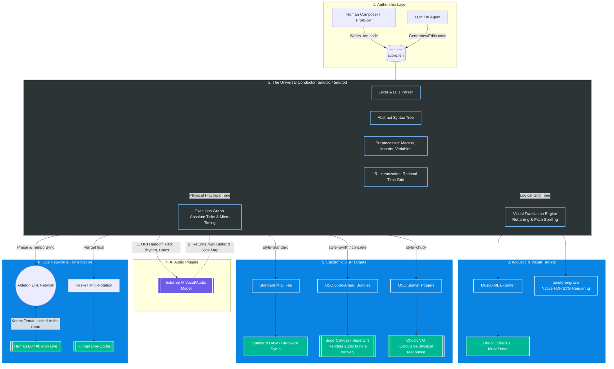

# Tenuto Reference Compiler (`tenutoc`) & Runtime Daemon (`tenutod`)

> **A declarative, domain-specific language (DSL) unifying classical notation and electronic DSP. Tenuto does for music what Mermaid did for diagrams: transforming cumbersome DAWs and bloated XML into a token-efficient, mathematically perfect coding experience built for human composers and AI alike.**

---

## The Vision

Music notation has been stuck for centuries. First, it was trapped on paper. Then it got locked inside bloated, machine‑generated XML. Modern DAWs gave us total control over audio but locked our compositions inside proprietary, unreadable black boxes.

And now, AI music generation has arrived as a "slot machine." You prompt a model, and it spits out a flattened, uneditable `.wav` file. If the vibe is perfect but the snare is slightly too loud? You can't edit it. You have to reroll and pray.

**Tenuto v3.0.0 changes everything.**

Tenuto is a deterministic, declarative language that unifies classical sheet music with modern electronic digital signal processing (DSP). But with the introduction of **Addendum A: The Ecosystem Integrations**, Tenuto transcends being a mere file format. It is now the **Universal Semantic Conductor**.

Instead of reinventing low-level audio math, Tenuto acts as the master logic brain. It calculates the absolute rational timeline and structural semantics, then dynamically orchestrates industry-standard physical engines (SuperCollider, ChucK) via Open Sound Control (OSC) and Ableton Link in real-time.

---

## The Holy Grail of AI Music & Live Collaboration

Large Language Models (LLMs) think in tokens. Because Tenuto is incredibly token-efficient and semantically dense, **an LLM can hold an entire multi-track song's logic in its working memory without losing the plot.**

Addendum A takes this off the computer screen and puts it on stage:

1. **The Live Jam:** You put an AI agent on stage with a live human DJ.
2. **The Sync:** The Tenuto runtime daemon (`tenutod`) connects to the human's Ableton Live session via **Ableton Link**, perfectly locking its internal rational grid to the shared room tempo and phase.
3. **The Generation:** The AI listens to the prompt context and dynamically writes a new Tenuto bassline measure block.
4. **The Execution:** Tenuto mathematically guarantees the AI's generation injects flawlessly on the shared downbeat. It fires look-ahead OSC bundles to **SuperCollider** (SuperDirt) to render the audio, or spawns parallel **ChucK** shreds to calculate physical string resonance on a sample-by-sample basis.

You get the infinite creative brainstorming of AI, the surgical precision of a text-based DAW, and the real-time, visceral energy of a live electronic performance.

---

## Use Cases

Tenuto is built for anyone who believes music should be readable, editable, future-proof, and alive.

* **🤖 AI-Assisted Composition & Algoraves:** The missing native language for AI music generation. Models can generate, analyze, and iteratively edit multi-track music deterministically, and even perform *live* with humans via Ableton Link.
* **🎛️ Live-Coders & Electronic Producers:** Write Euclidean rhythms (`(k):3/8`), trigger granular sample slices, and execute continuous 808 glides. Export your logic to **TidalCycles** Haskell syntax (`--target tidal`) or let Tenuto trigger your complex SuperCollider DSP graphs via OSC.
* **🎼 Classical Composers & Engravers:** Write symphonies in plain text. Compile code directly into MusicXML for use in Dorico/Sibelius, or output pristine MIDI.
* **👩‍🏫 Educators & Music Theorists:** Teach music theory using clean, readable code stripped of graphical accidents and proprietary software constraints.
* **💾 Archivists:** A century from now, musicians will be able to open a plain-text Tenuto file and see exactly what you intended to write.

---

## How It Works

### 1. Define Your Instruments (The Physics & The Delegation)

Define acoustic instruments, electronic synths, AI vocal plugins, or delegate the micro-physics entirely to external languages like ChucK.

```tenuto
%% Classical MIDI Routing
def violin "Violin I" style=standard clef=treble

%% SuperDirt / SuperCollider OSC Delegation
def sub "808 Bass" style=synth env=@{ a: 5ms, d: 1s, s: 100%, r: 50ms } cut_group=1

%% ChucK Physical Modeling Delegation
def phys_bass "Plucked String" style=chuck src="karplus_strong.ck"

%% AI Generative Plugin
def lead_vox "Lead Singer" style=concrete src="plugin://ai-vocal-gen"

```

### 2. Write the Music (The Macro-Logic)

```tenuto
measure 1 {
  %% Spawns a ChucK shred to physically model the string pluck
  phys_bass: c2:4.stacc d e f |

  %% 808 Synth triggering an OSC glide in SuperCollider
  sub: c2:2.glide(150ms) c3:2 |
  
  %% Tenuto maps the lyrics and exact timing to the AI vocal generator
  lead_vox: c4:4 d e f |
  lead_vox.lyric: "Do- ing it right"
}

```

### 3. Compile, Export, or Perform Live

```bash
# Get sheet music for engraving (MusicXML)
tenutoc --input score.ten --output score.musicxml

# Transpile to TidalCycles for a live-coding set
tenutoc --input score.ten --target tidal

# Run the live daemon synced to Ableton Link (Algorave mode)
tenutod --input score.ten --link --osc-target 127.0.0.1:57120

```

---

## Architecture: The Universal Semantic Conductor

To understand how Tenuto seamlessly bridges sheet music, electronic DSP, and generative AI, you have to look at the routing. Tenuto sits entirely in the center—acting as the brain—and delegates specialized work to the best tools in the world.



### How to Read the Architecture:

1. **The Core Split:** The Intermediate Representation (IR) splits the music into two distinct realities. **Logical Time** goes to the visual translation engine (slicing notes perfectly at barlines for sheet music). **Physical Time** applies the `.pull(15ms)` swing, glides, and sidechain automation.
2. **The AI Loop (Purple):** Tenuto reaches out to an AI vocal generator, hands it the lyrics and exact pitches, and the AI hands back a sliced audio buffer directly into Tenuto's physical timeline.
3. **The DSP Delegation (Green):** Tenuto doesn't generate synthesizer audio itself. It sends high-speed OSC commands to specialized engines like **SuperCollider** and **ChucK** to do the heavy acoustic lifting.
4. **The Live Sync (Bottom Right):** Because the `tenutod` daemon talks to **Ableton Link**, Tenuto's internal clock is slaved to the real world. If a DJ speeds up the track in Ableton, Tenuto instantly adjusts its calculations so its code executions land perfectly on the beat.

---

## What Makes Tenuto Different

| Format | Editable by Humans | AI Context-Friendly | Semantic Structure | Live DSP/OSC Orchestration | Future-Proof |
| --- | --- | --- | --- | --- | --- |
| MusicXML | ❌ | ❌ | ✅ | ❌ | ✅ |
| MIDI | ❌ | ❌ | ❌ | ❌ | ✅ |
| DAW Project | ❌ | ❌ | ✅ | ✅ | ❌ |
| Audio (.wav) | ❌ | ❌ | ❌ | ✅ | ✅ |
| **Tenuto 3.0** | ✅ | ✅ | ✅ | ✅ | ✅ |

---

## Current Status

**The Tenuto Language Specification v3.0.0 + Addendum A is officially complete.**

The reference compiler (`tenutoc`) and the runtime daemon (`tenutod`) are currently in active development to upgrade from the static v2.2.0 architecture to fully support the new v3.0.0 engines.

Currently, the `main` branch compiler can:

* Parse the v2.2+ Tenuto language.
* Generate standard MIDI files with all performance data.
* Export MusicXML 4.0 for use in MuseScore, Dorico, Sibelius.
* Validate scores in strict mode for archival quality.

---

## The Road Ahead

* **Phase V: The Producer Engines (In Progress)**
* Updating the AST and internal IR to resolve `style=synth` and `style=concrete`.
* Building the plugin architecture for external AI synthesis pipelines.


* **Phase VI: The Universal Conductor (Addendum A)**
* Building the `tenutod` runtime daemon.
* Integrating the Ableton Link API for phase/tempo network synchronization.
* Writing the OSC emitter backend to target SuperDirt/SuperCollider and ChucK.
* Implementing the `--target tidal` transpiler.


* **Phase VII: Developer Experience**
* **`tenuto-lsp`** — A Language Server for VS Code.
* **`tenuto-playground`** — A web editor to write, hear, and collaborate with AI assistants instantly.


* **Phase VIII: Native Engraving — `tenuto-engrave` (Spec Complete)**
* A native Rust engraving engine that renders publication‑ready sheet music directly from Tenuto source using ECS memory models and Cassowary constraint solvers. **It will be the Typst of music.**


---

## Join Us

This is an open standard, an open source compiler, and an open invitation. We need:

* **Rust developers** to help with the compiler, OSC backend, and Ableton Link integration.
* **AI / ML Researchers** to fine-tune open-source models on Tenuto syntax.
* **Audio Engineers & Live-Coders** to refine the SuperDirt and ChucK mapping protocols.

The language is stable. The vision is clear. **Now we build the ecosystem together.**

[Read the Full v3.0 Specification](https://www.google.com/search?q=./docs/SPEC.md) | [GitHub Discussions](https://github.com/alec-borman/TenutoNotationLanguage/discussions) | [MIT License](https://www.google.com/search?q=./LICENSE)
