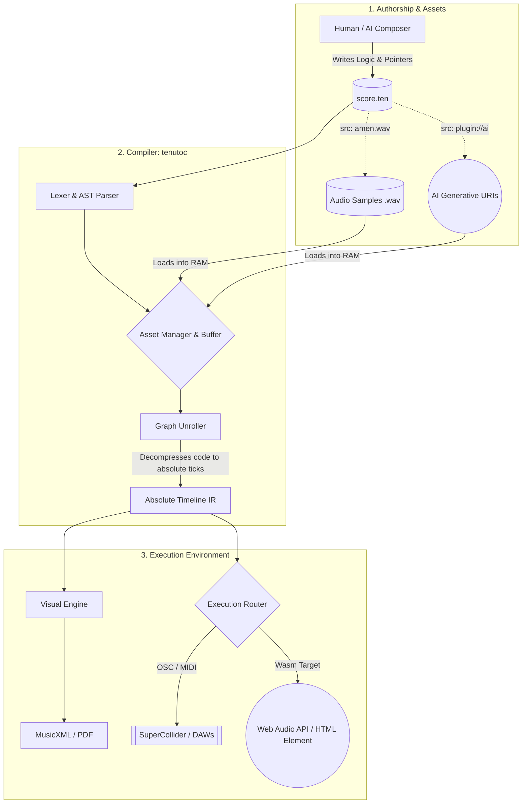

# Tenuto 3.0: The Universal Language for Music and Audio

**What HTML did for documents and Mermaid did for diagrams, Tenuto does for music.**

Tenuto is a declarative, domain‑specific language (DSL) that unifies classical music notation and modern digital signal processing (DSP) into a single, token‑efficient text format. Built on a mathematically rigorous architecture, Tenuto acts as a universal logic layer: you write the musical intent once, and the compiler can render it as sheet music, MIDI, real‑time synthesis instructions, or even native browser audio. 

---

## ⚠️ The Problem Tenuto Solves
Today’s digital music landscape is fractured:
*   **DAWs are closed ecosystems.** Project files are proprietary binary blobs that suffer from bit rot and vendor lock‑in. A session saved today may be unreadable in ten years.
*   **MusicXML is bloated.** Classical notation formats are machine‑generated, visually bound, and incredibly verbose—a single measure can consume over a thousand tokens, making them hostile to version control and prohibitively expensive for AI models to process.
*   **MIDI lacks structure.** MIDI captures performance data but discards semantic intent, loops, key signatures, and tuplets. It’s a recording of button presses, not a representation of music.
*   **AI music is static.** Generative models output flattened audio files. If a single note is wrong, the entire file must be regenerated—there is no editable source.

Tenuto solves these problems by providing a **semantic, archival‑safe, and editable standard**. It separates *what* the music is (the intent) from *how* it sounds (the execution), creating a single source of truth that can be compiled to any format.

---

## 🧠 Core Architecture & Features
The `tenutoc` compiler acts as an **asset linker and decompression engine**, reading a lightweight textual blueprint and dynamically orchestrating external assets (audio samples, tuning maps, AI generative URIs, and DSP scripts).

*   **1. Token‑Efficient & AI‑Native (Sticky State):** Tenuto uses semantic inference to eliminate redundancy. A line like `c4:4 d e f` automatically applies the duration (`:4`) and octave (`4`) to the subsequent notes. Where a single measure of MusicXML might consume 1,500 tokens in an LLM context window, Tenuto requires only 20. This allows AI models to natively read, write, and iteratively edit multi‑track symphonies within their working memory.
*   **2. Rational Temporal Execution:** Most sequencers suffer from floating‑point quantization drift. Tenuto’s Intermediate Representation (IR) calculates time using pure rational arithmetic (fractions), guaranteeing that complex tuplets and Euclidean rhythms remain mathematically perfect across thousands of measures.
*   **3. DSP Delegation & Live Sync:** Tenuto does not reinvent audio synthesis—it orchestrates it. Code can be compiled to Open Sound Control (OSC) bundles, triggering high‑performance engines like SuperCollider, ChucK, or Ableton Live. The `tenutod` runtime daemon integrates **Ableton Link**, allowing Tenuto scripts (and AI‑generated injections) to sync perfectly with shared network tempos during live performances.
*   **4. Zero‑Friction Web Runtime (Wasm):** Tenuto is built for the web. The parser compiles to WebAssembly (`wasm32-unknown-unknown`), mapping its execution graph directly to the browser’s native Web Audio API. This means you can embed procedural, interactive music in any web application with zero configuration—no plugins, no servers.

---

## 🚀 Potential Use Cases
Because Tenuto acts as a universal semantic layer, its applications extend far beyond traditional notation software or standard DAWs.

### 1. Artificial Intelligence & Generative Music
*   **Token-Efficient AI Co-Production:** The "Sticky State" cursor reduces file sizes by up to 90% compared to MusicXML. This makes it the ultimate lightweight format for LLMs.
*   **Autonomous AI Self-Correction:** Using the Tenuto Studio Architecture (TSA) and Agentic REPL, mathematically invalid code returns a structured JSON payload instead of crashing, allowing the AI to autonomously debug its own musical logic.
*   **Local Client-Side AI Execution:** The Web Runtime can intercept generative plugin URIs and utilize WebGPU/ONNX.js to run lightweight AI models natively in the browser.

### 2. Modern Electronic Music Production (DAW Replacement)
*   **Algorithmic & Euclidean Beatmaking:** Producers can generate complex syncopations by invoking Euclidean rhythms using the simple `(k):3/8` syntax, which perfectly distributes drum hits across a grid.
*   **Granular Synthesis & Audio Manipulation:** The Concrete Engine allows producers to directly map raw `.wav` files to alphanumeric keys, applying `.stretch` to phase-vocode samples to a metrical grid, or `.slice(N)` to chop audio mathematically.
*   **Trap 808 Glides & Drops:** Continuous frequency modulation is natively supported via attributes like `.glide()` and `.accelerate()`.
*   **Text-Based Sidechain Compression:** Producers can mathematically "pump" or duck the volume of sub-basses using invisible LFO automation curves via the "Spacer" token (`s:4.cc()`).
*   **Humanizing the "Pocket":** Micro-timing modifiers like `.push()` and `.pull()` shift physical audio playback by exact milliseconds, injecting deep groove without corrupting the quantized visual sheet music.

### 3. Web Development & Interactive Media
*   **Zero-Friction Procedural Browser Music:** The Tenuto parser compiles directly to WebAssembly, mapping its execution graph directly to the browser’s native Web Audio API. 
*   **HTML Custom Elements:** Using the `<tenuto-score>` HTML tag, developers with zero audio-engineering experience can embed, generate, and play procedural music natively.
*   **Interactive "Living Scores":** The SVG exporter permanently embeds absolute temporal data (`data-tick`) into the DOM, allowing developers to create 60 FPS playheads and CSS highlights that track the sounding music.

### 4. Live Coding, Algoraves & Hardware Orchestration
*   **Networked DSP Delegation:** Tenuto acts as a master conductor, firing OSC bundles over a network with look-ahead scheduling to execute sound on external synthesizers like SuperCollider and ChucK.
*   **Ableton Link Network Synchronization:** For live algorithmic performances, Tenuto natively locks its rational grid to a shared network phase. 
*   **On-The-Fly Transpilation:** Tenuto code can be automatically transpiled into Haskell-based mini-notation for live manipulation in TidalCycles.

### 5. High-End Typography & Avant-Garde Engraving
*   **Pixel-Perfect Classical Publishing:** The `tenuto-engrave` engine utilizes a Cassowary linear constraint solver for horizontal justification and hardware-accelerated SIMD Skyline arrays to generate flawless, collision-free SVGs.
*   **Graphic & Aleatoric Notation:** Unprintable physics (like raw audio) can be explicitly forced into a Graphic Notation Fallback, rendering aleatoric clusters or duration bounding boxes.
*   **Historical Notation:** The layout engine can dynamically mutate to render Renaissance Lute tablature or unmetered Gregorian chant.

### 6. Accessibility & Archival Preservation
*   **Infinite Mathematical Archiving:** Tenuto's Rational Temporal Engine stores all time as exact mathematical fractions, guaranteeing 0.00% temporal drift for archiving symphonies over centuries.
*   **Screen-Reader Compatible Scores:** The SVG engine injects semantic ARIA roles into the DOM, allowing visually impaired users to "tab" through a digital score and hear a perfectly accurate, semantic description of the music.
*   **Automated Braille Music Translation:** The Tenuto IR is a flattened, absolute-time stream that can natively output standard `.brf` (Braille Ready Format) files.

### 7. Machine Translation & Semantic Decompilation
*   **Reverse-Engineering Legacy Formats:** The deterministic Semantic Decompiler (`tenuto-decompile`) can ingest explicit, verbose machine formats like MIDI or MusicXML and reverse-engineer the original musical intent using LZ77 dictionary coding and reverse Bresenham line-drawing algorithms.

---

## 💻 Writing Tenuto (Syntax Example)
A single `.ten` file can simultaneously orchestrate acoustic sheet music, continuous piano pedaling, and micro-timed humanization. Here is a syntax example showcasing **Relative Pitch Heuristics**, **Micro-Timing**, and **Decoupled Control Lanes**:

```tenuto
tenuto "3.0" {
  meta @{ 
    title: "Morning Light", 
    composer: "Tenuto AI (Refactored for V3.0)", 
    tempo: 80, 
    time: "4/4", 
    key: "C" 
  }

  %% V3.0 RELATIVE PITCH: The right hand will calculate the closest interval
  %% automatically. We only have to define the octave on the very first note!
  def rh "Right Hand" style=relative patch="gm_piano"
  def lh "Left Hand"  style=standard patch="gm_piano"

  %% ========================================================================= 
  %% SECTION A: The Gentle Awakening (Measures 1-4) 
  %% 4 Measures of 4/4 = Exactly 16 Beats. 
  %% ========================================================================= 
  measure 1-4 { 
    rh: <[ 
      %% We explicitly set :4 after the rest.
      %% Notice there are NO octaves after e4. The engine tracks the contour perfectly! 
      v1: r:2 e4:4.mp g c e d c b g a b c d e g.pull(20ms) | 
    ]> 
    lh: <[ 
      v1: [c3 g3 e4]:1.arpeggio[c3 a3 f4]:1 [c3 g3 e4]:1 [f3 a3 c4]:1 |
    ]>
  }

  %% ========================================================================= 
  %% SECTION B: The Lift (Measures 5-8)
  %% ========================================================================= 
  measure 5-8 { 
    rh: <[ 
      v1: r:2 f4:4 e d e f g a b c a g f e d.pull(30ms) | 
    ]> 
    lh: <[ 
      v1:[c3 g3 e4]:1 [d3 a3 f4]:1 [e3 g3 c4]:1[f3 a3 d4]:1 | 
      %% V3.0 DECOUPLED PEDALING: Sits in its own lane, independent of notes!
      pedal: down:4 down:4 down:4 down:4 | 
    ]> 
  }

  %% ========================================================================= 
  %% SECTION A': The Return (Measures 13-16) 
  %% Stretching the tempo and pulling the final notes off the grid for a beautiful 
  %% humanized ritardando finish. 
  %% ========================================================================= 
  measure 13-16 { 
    meta @{ tempo:, curve: "linear", text: "Ritardando" }
    ...
  }
}
```

---

## 🚀 Current Status & Roadmap
The **Tenuto v3.0 Specification** is finalized, and the core Rust compiler architecture is fully operational.

*   🟢 **Available Now (v3.0.0 - The Producer Update):**
    The main branch contains the highly optimized Rust compiler (`tenutoc`). It is 100% core-compliant with the v3.0 Spec, capable of parsing Euclidean rhythms, generative auto-padding, concrete sampling, and synth physics. It currently exports to `.mid` (MIDI) and `.musicxml` (MusicXML 4.0) via a strict Visual-Acoustic Demarcation pass.
*   🔵 **In Development (The TSA & TEDP Ecosystem):**
    *   **Phase VI (`tenutod`):** Building the background daemon, Ableton Link phase synchronization, and OSC emitter backend for SuperCollider/ChucK.
    *   **Phase VII (`wasm32`):** Compiling the parser to WebAssembly and building the `<tenuto-score>` HTML Web Component.
    *   **Phase VIII (`tenuto-engrave`):** A native Rust engraving engine utilizing the Cassowary constraint solver to render publication‑ready SVG sheet music directly from Tenuto source.
    *   **Phase IX (`tenuto-decompile`):** The $O(n)$ reverse-inference pipeline to algorithmically compress raw MIDI/XML back into idiomatic, human-readable Tenuto code.

---

## How It Works: The Pipeline

The `tenutoc` compiler transforms a Tenuto source file into absolute‑time instructions through a strict compilation pipeline:




1. **Authorship** – A human or AI writes a `.ten` file that references external assets (samples, AI plugins, etc.).
2. **Compilation** – `tenutoc` parses the source, resolves all references, and generates an absolute‑timeline Intermediate Representation (IR) using rational arithmetic.
3. **Execution** – The IR is routed to one or more targets: visual notation (MusicXML/SVG), hardware/software synthesis (OSC/MIDI), or the browser’s Web Audio API.

---

## Writing Tenuto

A single `.ten` file can simultaneously orchestrate acoustic sheet music, granular sample playback, and remote AI vocal generation. Here’s a complete example:

```tenuto
tenuto "3.0" {
  meta @{ title: "Example", tempo: 120, time: "4/4" }

  %% Define instruments and their physics
  def piano "Piano" style=standard clef=treble
  def sub "808 Bass" style=synth env=@{ a: 5ms, d: 1s, s: 100%, r: 50ms }
  def vox "Lead AI" style=concrete src="plugin://ai-vocal-gen" map=@{ a:[0s, 1.2s] }

  measure 1 {
    %% Acoustic routing → sheet music / MIDI
    piano: c5:8.stacc d e f g a b c6:2.ten |

    %% DSP synthesis → Continuous 14-bit glides and Pitch dives
    sub: c2:2.glide(150ms) c3:2.accelerate(-12) |

    %% AI generative mapping → passes lyrics and pitch to a local WebGPU model
    vox: a:4.slice(4) |
    vox.lyric: "He- llo a- gain"
  }
}
```

---

## Current Status & Roadmap

The **Tenuto v3.0 Specification** is finalized, and the core Rust compiler architecture is fully operational. 

- 🟢 **Available Now (v3.0.0 - The Producer Update):**  
  The `main` branch contains the highly optimized Rust compiler (`tenutoc`). It is 100% core-compliant with the v3.0 Spec, capable of parsing Euclidean rhythms, generative auto-padding, concrete sampling, and synth physics. It currently exports to `.mid` (MIDI) and `.musicxml` (MusicXML 4.0) via a strict Visual-Acoustic Demarcation pass.  
  ```bash
  cargo install --path .
  tenutoc --input score.ten --output score.mid
  ```

- 🔵 **In Development (The TSA & TEDP Ecosystem):**
  - **Phase VI (`tenutod`):** Building the background daemon, Ableton Link phase synchronization, and OSC emitter backend for SuperCollider/ChucK.
  - **Phase VII (`wasm32`):** Compiling the parser to WebAssembly and building the `<tenuto-score>` HTML Web Component.
  - **Phase VIII (`tenuto-engrave`):** A native Rust engraving engine utilizing the Cassowary constraint solver to render publication‑ready SVG sheet music directly from Tenuto source.
  - **Phase IX (`tenuto-decompile`):** The $O(n)$ reverse-inference pipeline to algorithmically compress raw MIDI/XML back into idiomatic, human-readable Tenuto code.

---

## Contributing

Tenuto is an open standard and an open‑source project. We are actively seeking contributors in the following areas:

- **Rust Engineering:** WebAssembly compilation, constraint-solving (Cassowary), and network daemons (Ableton Link / OSC).
- **AI/ML Research:** Fine‑tuning LLMs on the Tenuto syntax and integrating generative audio plugin endpoints.
- **Audio DSP:** Refining the SuperDirt and ChucK mapping protocols.

- [Read the Full v3.0 Specification](https://github.com/alec-borman/TenutoNotationLanguage/blob/main/docs/SPEC.md)
- [Join the Discussions](https://github.com/alec-borman/TenutoNotationLanguage/discussions)
-[Report an Issue](https://github.com/alec-borman/TenutoNotationLanguage/issues)

**License:** MIT

---

*Tenuto: Write music as code. Compile to everything.*
