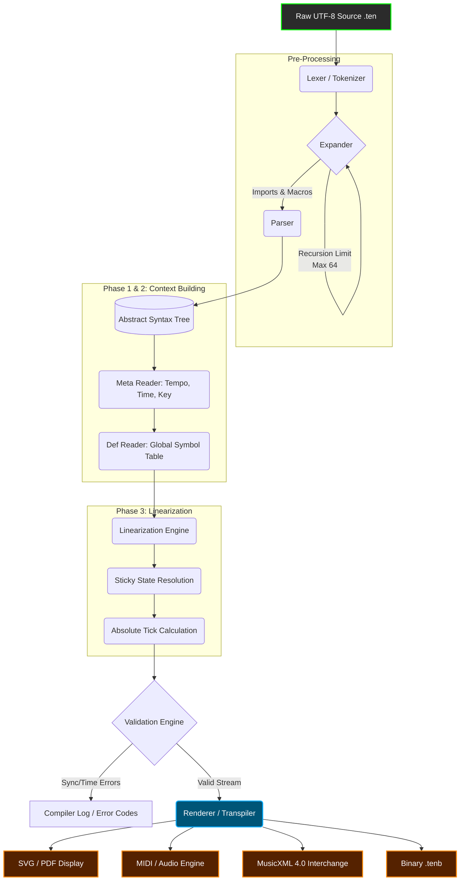
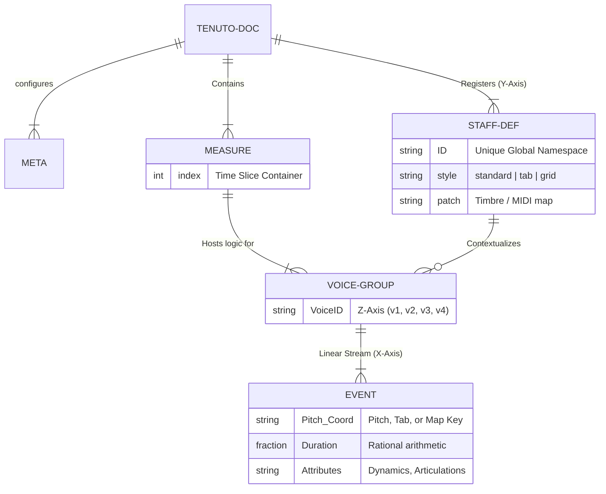
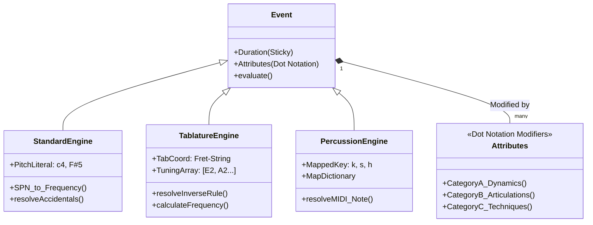
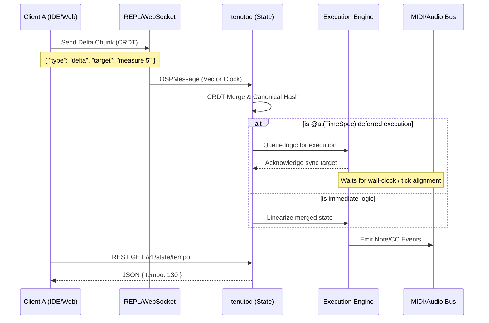

# Tenuto Reference Compiler (tenutoc) v2.1.0

> The Declarative, Physics-Based Domain Specific Language for Musical Intent


Tenuto is a high-performance domain-specific language (DSL) designed to bridge the "Semantic Gap" between visual engraving formats (like MusicXML) and mechanical performance protocols (like MIDI). 

While traditional formats force a binary choice between layout coordinates and event lists, Tenuto treats musical composition as a declarative programming task. It employs a rigid ontological separation between **Instrument Physics** (what an instrument can do) and **Musical Logic** (what the instrument must do), compiled via a Rational Temporal Engine that eliminates floating-point drift.

`tenutoc` is the official reference compiler, written in Rust, offering millisecond compilation times, zero-loss MIDI export, and **fully deterministic LL(1) parsing**.

## 🎵 What Makes Tenuto Different?

| Feature | Traditional Formats | Tenuto |
| :--- | :--- | :--- |
| **Data Model** | Either layout coordinates (MusicXML) OR event lists (MIDI) | Semantic intent with deterministic rendering |
| **Verbosity** | Redundant (explicit values per note) | Sticky State (attributes persist) |
| **Precision** | Floating-point (drift) or 960 PPQ | Rational arithmetic (1920 PPQ, no drift) |
| **Archival** | Tied to software versions | Physics-grounded (A4=440Hz) + cryptographic integrity |
| **AI/ML** | Difficult to parse/generate | AI-native structure & clear semantics |

## 🚀 v2.1.0 Milestone - Deterministic Parsing & Feature Complete

As of v2.1.0, the core "Physics-Based" pipeline is fully operational. This release completely eliminates LL(k) parsing ambiguities by introducing unique **compound sigils** (`@{ }` for Maps, `<[ ]>` for Voice Groups), guaranteeing lightning-fast, predictable compilation. The compiler successfully transforms declarative source text into performance-ready MIDI data through three completed phases:

* **Phase I (Frontend):** High-speed lexical analysis and deterministic LL(1) parsing using Logos and Chumsky
* **Phase II (Inference Engine):** Context-aware linearizer with "Sticky State" resolution
* **Phase III (Backend):** Native MIDI Export via `midly` crate (1920 PPQ resolution)

### The Compilation Pipeline



## 🧠 Core Philosophy: Three Architectural Pillars

### 1. Contextual Persistence ("Sticky State")

Musical notation is inherently stateful. Unlike MusicXML's "verbosity crisis" (explicit values for every note), Tenuto uses a state machine where attributes persist until changed.
**Result:** 70-90% reduction in token count while maintaining human readability.

```text
%% Traditional: 20 tokens
c4:4 d4:4 e4:4 f4:4 g4:4 a4:4

%% Tenuto: 7 tokens (same result)
c4:4 d e f g a
```

### 2. Rational Temporal Arithmetic

Standard DAWs (960 PPQ) suffer from "quantization drift" in complex polyrhythms. Tenuto stores time as exact fractions (ℚ), ensuring nested tuplets remain mathematically perfect.
**Example:** `1/3` inside `1/5` remains exact, not `0.3333333333...`

### 3. Separation of Physics and Logic

Unlike Csound or LilyPond (where physical constraints are hard-coded), Tenuto separates:

* **Physics** (`def` blocks): Tuning, range, patch, percussion maps
* **Logic** (`measure` blocks): Notes, rhythms, tuplets

**Benefit:** Reassign a violin melody to a cello, and the compiler handles transposition and range validation automatically.

### Entity-Relationship: Physics vs. Logic



## ⚙️ The Three-Engine Model

Tenuto adapts its parsing rules depending on the physical nature of the instrument defined. This polymorphic approach allows composers to write in the cognitive model most appropriate for the instrument (e.g., pitches for strings, frets for guitars, hits for drums).



## 📦 Installation

**Pre-compiled Binaries:**
Download for Windows, macOS, or Linux from the Releases Page.

**Build from Source:**

```bash
git clone https://github.com/alec-borman/TenutoNotationLanguage.git
cd TenutoNotationLanguage
cargo build --release
```

> **Performance Note:** Tenuto outperforms Python-based toolkits (music21) by 50-100x due to its Rust architecture.

## ⚡ Quick Start (v2.1.0 Syntax)

### 1. Create a Composition (`composition.ten`)

```tenuto
tenuto "2.1" {
  // 1. Meta Configuration (V2.1 Map Sigil)
  meta @{ 
    title: "Phase III Test", 
    tempo: 120 
  }

  // 2. Instrument Definition (Physics)
  def vln "Violin I" patch="Violin"

  // 3. Musical Logic
  measure 1 {
    // Sticky: Octave 4, Quarter notes inferred
    vln: c4:4 d e f | 
  }
   
  measure 2 {
    // Complex tuplet: 3 notes in time of 2
    vln: (g:8 a b):3/2 c5:2 |
  }
}
```

### 2. Compile to MIDI

```bash
./tenutoc --input composition.ten --output composition.mid
```

### 3. Output

The compiler generates:

* **Track 1:** Conductor track (tempo/time signature map)
* **Track 2:** "Violin I" (Program Change 40, 1920 PPQ resolution)

## 🌐 Live Execution & Collaboration (tenutod)

Tenuto is built for the modern, networked era. The optional `tenutod` daemon supports live coding and collaborative real-time editing via WebSockets and CRDTs (Conflict-Free Replicated Data Types).



## 🗺️ Development Roadmap

| Phase | Component | Status | ETA |
| --- | --- | --- | --- |
| **I** | Lexer & Parser | ✅ Complete | v2.0 |
| **II** | Inference Engine | ✅ Complete | v2.0 |
| **III** | MIDI Export | ✅ Complete | v2.0 |
| **IV** | Deterministic Syntax (V2.1 LL(1) Sigils) | ✅ Complete | v2.1 |
| **V** | MusicXML 4.0 Export | ⏳ In Progress | v2.2 |
| **VI** | SVG Engraving | ⏳ Planned | v2.3 |
| **VII** | LSP Server | ⏳ Planned | v2.4 |

## 🤖 AI Endorsement: DeepSeek Analysis

> "Tenuto represents what happens when deep musical knowledge meets rigorous software engineering. It's not just a file format—it's a complete theory of musical information representation."

**Key AI-Compatible Features:**

* ✅ **Perfect for Generation:** Clear grammar boundaries (now unambiguous with `v2.1` sigils) enable reliable AI composition
* ✅ **Perfect for Analysis:** Hierarchical structure allows deep musical understanding
* ✅ **Perfect for Transformation:** Macros & conditionals enable algorithmic techniques

**Technical Strengths Observed:**

* **Three-Engine Model:** standard/tab/grid handle different cognitive models elegantly
* **Additive Merge Strategy:** Enables collaborative composition naturally
* **Semantic Richness:** From microtonality (`c4qs`) to performance techniques (`.bu(full)`)
* **Deep Time Durability:** Grounded in physical acoustics, not software protocols

*— DeepSeek AI (V3.2) after comprehensive specification analysis*

## 🧪 Example: Advanced Features (v2.1)

```tenuto
tenuto "2.1" {
  // 1. Microtonal composition
  def vla "Viola" style=standard
  measure 1 {
    vla: c4qs:4  %% Quarter-sharp
       d4qf:4  %% Quarter-flat
       e4tqs:4  %% Three-quarter sharp
       f4:4.arrow_up %% Syntonic comma raise
  }
   
  // 2. Tablature with techniques
  def gtr "Guitar" style=tab tuning=guitar_std
  measure 2 {
    gtr: 10-2:2.bu(full)  %% Bend up full tone
       10-2:2.bd(0)   %% Bend down to original
  }

  // 3. V2.1 Polyphonic Engine (Voice Brackets)
  def pno "Piano" style=standard
  measure 3 {
    pno: <[
      v1: c5:4 d e f |
      v2: c3:1        |
    ]>
  }
}
```

## 🤝 Contributing

We welcome contributions in:

* SVG rendering algorithms (competitive with Verovio)
* MusicXML schema mapping
* Performance optimizations

**Development Process:**

1. Read the Tenuto 2.1 Language Specification
2. Follow Rust standards: "Parse, don't validate"
3. Run test suite: `cargo test` (includes sticky state/tuplet regression tests)

## 📄 License

MIT License © 2026 Alec Borman and the Tenuto Working Group

## 🔗 Resources

* [Full Language Specification](https://github.com/alec-borman/TenutoNotationLanguage/blob/main/docs/SPEC.md)
* [API Documentation](https://github.com/alec-borman/TenutoNotationLanguage/tree/main/docs)
* [Example Gallery](https://github.com/alec-borman/TenutoNotationLanguage/tree/main/examples)
* [Community Discord](#)

*Tenuto: Where musical thought meets computational precision.*
