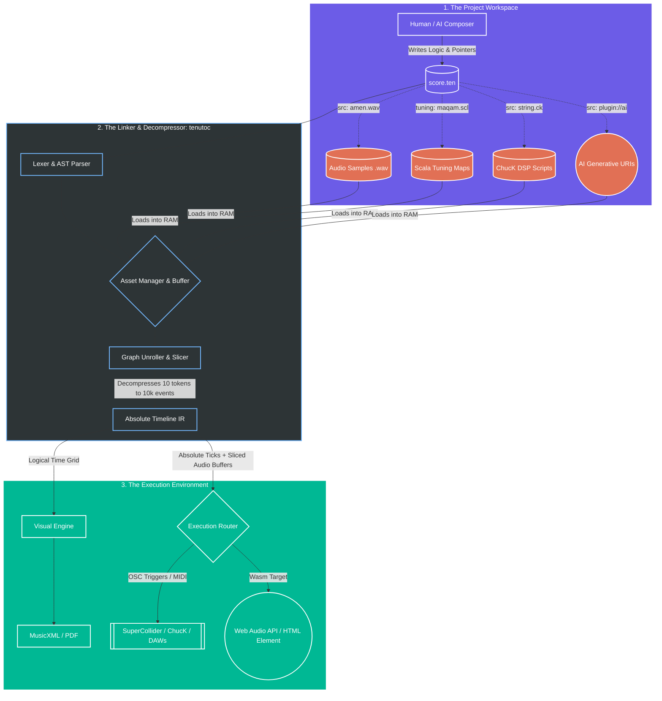

# Tenuto Reference Compiler (`tenutoc`) & Web Runtime

> **A declarative, domain-specific language (DSL) unifying classical notation and electronic DSP. Tenuto does for music what Mermaid did for diagrams: transforming cumbersome DAWs and bloated XML into a token-efficient, mathematically perfect coding experience built for human composers and AI alike.**

---

## The Vision: The Universal Language of Music

For decades, digital music has been fractured. Classical notation is locked inside bloated, unreadable XML schemas. Modern electronic production is trapped inside proprietary, binary Digital Audio Workstation (DAW) files that rot over time.

Furthermore, the rise of Generative AI has turned music creation into a "slot machine." You prompt a model, and it spits out a flattened, uneditable audio file. If the snare is slightly too loud, you cannot edit it; you must reroll entirely.

**Tenuto v3.0 changes the paradigm.** Tenuto is a deterministic, highly compressed text format that separates *what* the music is from *how* it is physically rendered. By acting as the **Universal Semantic Conductor**, Tenuto allows an AI (or a human) to write pure musical logic in a tiny text file, and dynamically orchestrate that logic across sheet music engravers, heavy-duty DSP engines, and native web browsers.

---

## 🟢 Current Status: What You Can Do *Right Now* (v2.2.0 Stable)

The current `main` branch contains the stable v2.2.0 Rust compiler (`tenutoc`). It is a fully functional, highly optimized engine for acoustic composition, strict temporal validation, and standard sequencing.

### Features Available Today:

* **Semantic Inference (Sticky State):** Write `c4:4 d e f`. The compiler remembers the duration and octave automatically.
* **Exact Rational Time:** Rhythms are calculated using pure fractions (Numerator/Denominator), mathematically eliminating IEEE 754 floating-point temporal drift.
* **Multiple Output Targets:** Compile a single `.ten` file into a `.mid` file for DAW playback, or a `.musicxml` file for beautiful sheet music engraving in Dorico/Sibelius.

**Compile it today:**

```bash
cargo install --path .
tenutoc --input score.ten --output score.mid
tenutoc --input score.ten --output score.musicxml

```

---

## 🔵 The Horizon: The v3.0.0 Ecosystem (Spec Complete)

The v3.0.0 Specification introduces two massive architectural addenda that elevate Tenuto from a simple compiler into a **dynamic package manager and real-time execution environment.**

### Addendum A: The Pro-Audio Orchestrator

Tenuto acts as the master logic brain, delegating the heavy acoustic lifting to industry-standard open-source engines.

* **The AI-to-DSP Bridge:** Tenuto fires Open Sound Control (OSC) bundles to **SuperCollider** or spawns parallel **ChucK** shreds to render audio buffers and physical string modeling in real-time.
* **Live Algoraves (Ableton Link):** The new `tenutod` runtime daemon locks its internal rational grid to the shared room tempo. An AI can inject new code live, mathematically guaranteed to trigger on the network downbeat.

### Addendum B: The Zero-Friction Web Runtime

You do not need to be an audio engineer to use Tenuto. By compiling the `tenutoc` parser to **WebAssembly (Wasm)**, Tenuto runs natively in the browser.

* **Native Web Audio:** Tenuto maps its Intermediate Representation (IR) directly to the browser's native `AudioWorkletNode` and `AudioBufferSourceNode` scheduling.
* **The HTML Custom Element:** Web developers can embed procedural, AI-generated music into any webpage with zero configuration:

```html
<tenuto-score src="./soundtrack.ten" controls autoplay loop>
    Your browser does not support the Tenuto Web Runtime.
</tenuto-score>

```

---

## Architecture: The Asset Linker & Decompression Engine

Stop thinking of Tenuto as a text-to-MIDI converter. **Tenuto is a Package Manager for audio.**

The `.ten` source code is a highly compressed blueprint. It contains the musical logic and **multi-way pointers** to external assets (folders of `.wav` slices, `.scl` tuning maps, or URIs for AI vocal generators). The compiler fetches these scattered assets, decompresses the token-efficient logic into an absolute microsecond timeline, and routes it to the correct execution engine.



---

## Why Tenuto is the Holy Grail for AI Music

Large Language Models (LLMs) think in tokens, and their context windows are precious. A single measure of MusicXML can consume 1,500 tokens. Tenuto requires 20.

Because Tenuto is incredibly token-efficient and utilizes standard programming paradigms (dot-chaining, JSON-style dictionaries, scoping), **an LLM can hold an entire multi-track song's logic in its working memory without losing the plot.**

It turns AI from a random audio slot machine into a deterministic, collaborative studio engineer. You ask the AI for a track, listen to the compiled result in your browser, and say, *"The groove is too stiff."* The AI doesn't hallucinate a new `.wav` file—it simply edits the code, adding a global `swing: 66` and a `.pull(15ms)` on the snare.

---

## The Roadmap

The language grammar is stable. The v3.0 blueprint is mathematically finalized. We are currently actively writing the Rust infrastructure to bring the Universal Conductor to life.

* **Phase IV (Current):** Stabilize `tenutoc` v2.2.0 MIDI/MusicXML generation.
* **Phase V (In Progress):** Upgrade the Rust AST to resolve the v3.0 `style=synth` and `style=concrete` paradigms.
* **Phase VI (Addendum A):** Build the `tenutod` runtime daemon, Ableton Link synchronization, and OSC emitter backend for SuperCollider/ChucK.
* **Phase VII (Addendum B):** Compile the parser to `--target wasm` and build the `<tenuto-score>` Web Component.
* **Phase VIII:** `tenuto-engrave` — A native Rust engraving engine that renders publication‑ready sheet music directly from Tenuto source using ECS memory models. **It will be the Typst of music.**

---

## Join the Ecosystem

This is an open standard, an open source compiler, and an open invitation. We need:

* **Rust Developers** to help upgrade the compiler to Wasm and build the OSC/Ableton Link backends.
* **AI / ML Researchers** to fine-tune open-source models on Tenuto syntax.
* **Audio Engineers** to refine the SuperDirt and ChucK mapping protocols.

**The future of music is plain text. Now we build the ecosystem together.**

[Read the Full v3.0 Specification](https://www.google.com/search?q=./docs/SPEC.md) | [GitHub Discussions](https://github.com/alec-borman/TenutoNotationLanguage/discussions) | [MIT License](https://www.google.com/search?q=./LICENSE)
