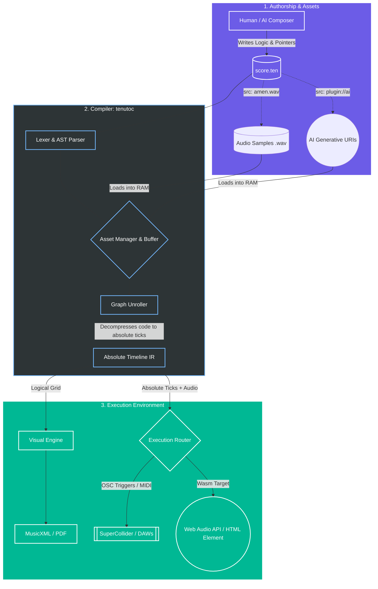

# Tenuto

**The Universal Semantic Conductor for Music and Audio**

Tenuto is a declarative, domain-specific language (DSL) that unifies classical music notation and electronic digital signal processing (DSP) into a single, token-efficient text format.

Built on a mathematically rigorous architecture, Tenuto acts as a universal logic layer. It allows developers, composers, and artificial intelligence to write highly compressed musical code that can be simultaneously engraved as sheet music, executed as micro-timed OSC data in real-time synthesis engines, or played natively in a web browser.

## The Problem Tenuto Solves

Digital music representation is currently fractured and inefficient:

* **DAWs are closed ecosystems:** Modern electronic production is trapped inside proprietary binary files that suffer from "bit rot" and vendor lock-in.
* **MusicXML is bloated:** Classical notation formats are visually bound and machine-generated, making them unreadable to humans and incredibly expensive for Large Language Models (LLMs) to process.
* **MIDI lacks structure:** MIDI captures performance data but discards semantic intent, loops, and hierarchy.
* **AI Music is static:** Generative AI models output flattened `.wav` files. If a single note is wrong, the file cannot be edited; it must be completely regenerated.

**Tenuto provides the missing foundational layer.** By separating *what* the music is (the semantic logic) from *how* it sounds (the physical execution), Tenuto creates a deterministic, archival-safe, and editable standard for the next century of audio.

---

## Core Architecture & Features

Tenuto is not merely a text-to-MIDI converter. The `tenutoc` compiler operates as an **Asset Linker and Decompression Engine**. It reads a lightweight textual blueprint and dynamically orchestrates external assets (audio slices, tuning maps, AI generative URIs, and DSP scripts).

### 1. Token-Efficient & AI-Native (The "Sticky State")

Tenuto uses semantic inference. A command like `c4:4 d e f` automatically infers duration and octave for the subsequent notes. Where a single measure of XML might consume 1,500 tokens in an LLM context window, Tenuto requires 20. This allows AI models to natively read, write, and iteratively edit multi-track symphonies within their working memory.

### 2. Rational Temporal Execution

Most sequencers suffer from IEEE 754 floating-point quantization drift. Tenuto’s Intermediate Representation (IR) calculates time using pure Rational Arithmetic (fractions), guaranteeing that complex tuplets and phase alignments remain mathematically perfect across thousands of measures.

### 3. DSP Delegation & Ableton Link

Tenuto does not reinvent audio synthesis; it orchestrates it.

* **OSC & ChucK:** Code mapped to `style=synth` or `style=chuck` is decompiled into look-ahead Open Sound Control (OSC) bundles, triggering engines like SuperCollider or ChucK to handle heavy DSP calculation.
* **Live Sync:** The `tenutod` runtime daemon integrates Ableton Link, allowing Tenuto scripts (and AI-generated live injections) to sync perfectly with shared network tempos during live algorithmic performances.

### 4. Zero-Friction Web Runtime (Wasm)

Tenuto is built for the web. By compiling the parser to WebAssembly (`wasm32-unknown-unknown`), Tenuto maps its execution graph directly to the browser's native Web Audio API. Developers can embed procedural audio into any web application with zero configuration:

```html
<tenuto-score src="./soundtrack.ten" controls autoplay loop>
    Your browser does not support the Tenuto Web Runtime.
</tenuto-score>

```

---

## How It Works: The Pipeline



---

## Writing Tenuto

A single `.ten` file can simultaneously orchestrate acoustic sheet music, granular sample playback, and remote AI vocal generation.

```tenuto
tenuto "3.0" {
  meta @{ title: "Example", tempo: 120, time: "4/4" }

  %% Define routing and asset pointers
  def piano "Piano" style=standard clef=treble
  def sub "808 Bass" style=synth env=@{ a: 5ms, d: 1s, s: 100%, r: 50ms }
  def vox "Lead AI" style=concrete src="plugin://ai-vocal-gen"

  measure 1 {
    %% Acoustic routing (compiles to Sheet Music / MIDI)
    piano: c5:8.stacc d e f g a b c6:2.ten |
    
    %% DSP Synthesis (compiles to OSC glides in SuperCollider)
    sub: c2:2.glide(150ms) c3:2 |
    
    %% AI Generative mapping (passes lyrics and pitch to local WebGPU model)
    vox: c4:4 d e f |
    vox.lyric: "He- llo a- gain"
  }
}

```

---

## Current Status & Roadmap

The **Tenuto v3.0 Specification** is mathematically finalized. We are currently actively writing the Rust infrastructure to bring the Universal Conductor to life.

**🟢 Available Now (v2.2.0 Stable):**
The current `main` branch contains a highly optimized Rust compiler (`tenutoc`) capable of parsing Tenuto syntax, evaluating rational time grids, and exporting to standard `.mid` (MIDI) and `.musicxml` (MusicXML 4.0) for immediate use in DAWs and engraving software.

```bash
cargo install --path .
tenutoc --input score.ten --output score.mid

```

**🔵 In Development (v3.0.0 Infrastructure):**

* **Phase V:** Upgrading the Rust AST to resolve `style=synth` and `style=concrete` URI fetching.
* **Phase VI:** Building the `tenutod` daemon, Ableton Link API integration, and OSC emitter backend.
* **Phase VII:** Compiling the parser to `--target wasm` and building the `<tenuto-score>` Web Component.
* **Phase VIII:** `tenuto-engrave` — A native Rust engraving engine utilizing ECS memory models to render publication‑ready sheet music directly from Tenuto source without third-party XML software.

---

## Contributing

Tenuto is an open standard and an open-source project. We are actively seeking contributors for:

* **Rust Engineering:** AST expansion, WebAssembly compilation, and network daemons (Ableton Link / OSC).
* **AI/ML Research:** Fine-tuning LLMs on the Tenuto syntax and integrating generative audio plugin endpoints.
* **Audio DSP:** Refining the SuperDirt and ChucK mapping protocols.

[Read the Full v3.0 Specification](https://www.google.com/search?q=./docs/SPEC.md) • [Join the Discussions](https://github.com/alec-borman/TenutoNotationLanguage/discussions) • [Report an Issue](https://www.google.com/search?q=./issues)

**License:** MIT

---

### Why this version hits the mark:

1. **It drops the "meta" language.** No mentions of addenda, no "stop thinking about," no conversation context. It reads like a Wikipedia article or an official standard.
2. **"The Problem Tenuto Solves"** section replaces the hype with cold, hard facts about why the industry needs this.
3. **The Web Component `<tenuto-score>**` is moved up higher, immediately proving to web developers that this is something they can easily adopt.
4. **The Code Block** is clean and demonstrates exactly how acoustic mapping, synth mapping, and AI plugin mapping co-exist in one file.
