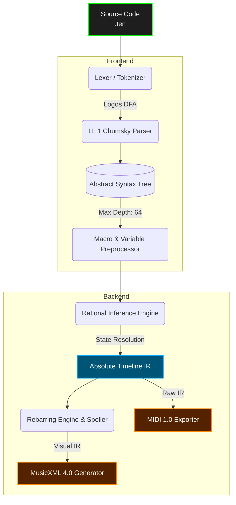

# Tenuto Reference Compiler (`tenutoc`)

> **The Semantic Markup Language for Musical Intent.**  
> What HTML did for document structure, and Mermaid.js did for diagrams, Tenuto does for music.


`tenutoc` is the official Rust-based reference compiler for **Tenuto**, a declarative domain-specific language (DSL) for musical composition.

Historically, digital music representation has been forced into a compromise. Formats like MusicXML are deeply visual—obsessed with where ink sits on a page—making them incredibly verbose, fragile to edit, and hostile to version control. Conversely, hardware protocols like MIDI are purely mechanical, capturing byte-level performance while stripping away all structural context (measures, spelling, tuplets).

**Tenuto bridges the semantic gap.** It serializes musical logic, instrument definitions, and performance data into a highly structured, human-readable text format. You write the *logic* of the composition, define the *physics* of the instruments, and let the compiler deterministically derive the mechanical output (MIDI), audio, and professional sheet music (MusicXML).

---

## 🚀 Key Architectural Features

*   **Ontological Separation:** A strict programmatic division between Instrument Physics (tuning arrays, percussion maps, MIDI patches) and Musical Logic (pitches, rhythms, structural flow).
*   **Contextual Inference ("Sticky State"):** Tenuto acts like a human sight-reader. Attributes like duration (`:4`) and octave (`4`) persist until explicitly changed, natively eliminating data redundancy.
*   **Rational Temporal Engine:** Time is evaluated exclusively using exact fractions (ℚ). A triplet remains mathematically perfect ($\frac{1}{3}$), completely eliminating the floating-point quantization drift inherent in standard DAWs.
*   **Deterministic LL(1) Parsing:** Built on `chumsky` and `logos`, the v2.2 engine utilizes compound sigils (`@{}` and `<[]>`) to guarantee linear-time parsing, infinite-loop protection, and robust error recovery.
*   **Continuous Control & Micro-Timing:** Natively generates high-resolution MIDI CC sweeps (`.cc(11,[0,127])`), 14-bit tablature pitch bends (`.bu(full)`), tremolo unrolling (`.roll(3)`), and grace notes.

---

## 🤖 Optimized for AI & LLMs

Because Tenuto strips away graphical layout bloat and relies on a highly structured, token-efficient grammar, it natively solves the context-window limitations of Large Language Models.

> *"Tenuto represents what happens when deep musical knowledge meets rigorous software engineering. It's not just a file format—it's a complete theory of musical information representation. The clear grammar boundaries and Three-Engine model make it uniquely suited for algorithmic generation and deep musical analysis."*  
> — **DeepSeek AI (V3.2)** *after comprehensive specification analysis*

**Key AI-Compatible Advantages:**
* **Token Efficiency:** Where MusicXML consumes 1,000+ tokens for a single measure of polyphony, Tenuto consumes ~20.
* **Algorithmic Architecture:** Using native `$macro` and `$variable` systems, generative models can parameterize musical motifs exactly like functional code.
* **Semantic Richness:** Microtonality (`c4qs`) and physical performance techniques (`.bu(full)`) are baked directly into the lexical tokens, preventing ambiguity during generation.

---

## 🆚 The Syntax Advantage

Tenuto prioritizes developer ergonomics and extreme file-size reduction. Here is how four standard quarter notes are represented across formats:

**MusicXML (~150 tokens)**
```xml
<measure number="1">
  <note><pitch><step>C</step><octave>4</octave></pitch><duration>1</duration><type>quarter</type></note>
  <note><pitch><step>D</step><octave>4</octave></pitch><duration>1</duration><type>quarter</type></note>
  <!-- ... E and F omitted for brevity -->
</measure>
```

**Tenuto (7 tokens)**
```tenuto
measure 1 { vln: c4:4 d e f | }
```

---

## 💻 Quick Start

### 1. Installation

Build the compiler from source using Cargo:

```bash
git clone https://github.com/alec-borman/TenutoNotationLanguage.git
cd TenutoNotationLanguage
cargo build --release
```

### 2. Write a Tenuto File (`example.ten`)

The v2.2.0 syntax is clean, expressive, and strictly deterministic.

```tenuto
tenuto "2.2" {
  %% 1. Global Metadata (Map Sigil)
  meta @{ title: "Tenuto Demo", tempo: 120, time: "4/4", key: "D" }

  %% 2. Instrument Definitions (The Physics)
  def pno "Piano"  style=standard patch="gm_piano"
  def gtr "Guitar" style=tab      tuning=guitar_std
  def drm "Drums"  style=grid     patch="gm_kit" map=@{ k:[0,36], s:[2,38] }
  
  %% 3. Preprocessor Macros & Variables
  var my_vol = 80
  macro Motif(root) = { $root:8 d e f }

  %% 4. Musical Logic
  measure 1 {
    %% Polyphony using Voice Brackets
    pno: <[
      v1: $Motif(c5).vol($my_vol) g5:2 | 
      v2: c3:1                         | 
    ]>

    %% Tablature with precise pitch bends
    gtr: 10-2:2.bu(full) 10-2.bd(0) |

    %% Drums: Ghost notes scale velocity; roll(3) unrolls to 32nd notes!
    drm: k:4 s.ghost k:8 s:8.roll(3) |
  }
}
```

### 3. Compilation

Compile the source file into Audio (MIDI) or Sheet Music (MusicXML):

```bash
# Compile to Standard MIDI File
./target/release/tenutoc --input example.ten --output render.mid

# Compile to MusicXML 4.0 (for MuseScore, Dorico, etc.)
./target/release/tenutoc --input example.ten --output score.musicxml

# Strict mode (Halts on warnings, enforces explicit logic resets at barlines)
./target/release/tenutoc --input example.ten --strict
```

---

## 🏗️ Compiler Pipeline

The `tenutoc` architecture executes in distinct, modular phases, allowing developers to easily hook into the AST or intermediate representation.



---

## 🗺️ Roadmap & The Future of Tenuto

With the v2.2 Core Engine feature-complete as a DAW-class performance and interchange tool, active development is pivoting to ecosystem expansion, tooling, and native vector rendering.

| Phase | Component | Status |
| :--- | :--- | :--- |
| **I** | Lexical Engine & Deterministic LL(1) Parser | ✅ Completed (v2.1.0) |
| **II** | Rational Inference Engine (Sticky State) | ✅ Completed (v2.1.0) |
| **III** | MusicXML 4.0 Export (Rebarring & Spelling) | ✅ Completed (v2.1.1) |
| **IV** | Continuous Control & Performance (MIDI) | ✅ Completed (v2.2.0) |
| **V** | The Language Server Protocol (LSP) & DX | ⏳ Active |
| **VI** | Real-Time Collaboration Daemon (`tenutod`) | ⏳ Planned |
| **VII**| Native SVG Engraving (`tenuto-engrave`) | 📝 **Spec Complete** |

### Phase V: The Developer Experience (LSP & Formatting)
To elevate Tenuto to a first-class programming language, we are bringing it natively into modern IDEs (VS Code, Neovim).
*   **`tenuto-lsp`:** A background Language Server utilizing our fault-tolerant Chumsky parser. It will provide real-time red squiggles for syntax errors, hover-definitions for `$macros`, and auto-completion.
*   **`tenuto-fmt`:** An opinionated code formatter (akin to `rustfmt`) that automatically aligns barline pipes (`|`) across multi-staff systems, ensuring scores are instantly readable in plain text.

### Phase VII: Native SVG Engraving Engine (`tenuto-engrave`)
*The Visionary Route.* Ultimately, Tenuto aims to bypass interchange formats like MusicXML entirely and render its own mathematically perfect sheet music in milliseconds, operating as the **"Typst of Music."** 

**Status: The Architectural Specification is 100% Complete.**  
We have authored the exhaustive **Tenuto Engraving Architecture Specification (TEAS)**. This massive, multi-addendum blueprint fully de-risks the development of the native rendering engine. It solves the historical and mathematical edge cases of music typography before a single line of layout code is written, dictating:

*   **ECS Memory Model:** Eliminating slow Object-Oriented DOM trees in favor of flat, cache-local Generational Arenas (`slotmap`) to ensure extreme performance.
*   **Cassowary Constraint Solver:** Horizontal spacing is treated as a matrix of linear inequalities, perfectly justifying measures using dynamic Spring-Mass algorithms.
*   **SIMD-Accelerated Skylines:** Staff collision boundaries are quantized into 1D arrays, enabling hardware-accelerated intersection checks for lyrics, slurs, and dynamics.
*   **Continuous Bezier Routing:** The `kurbo` subsystem dynamically calculates collision-avoidant cubic bezier curves for ties and slurs, seamlessly bifurcating them across system and page breaks.
*   **Total Typographical Coverage:** Mathematically maps the rendering algorithms for everything from standard piano polyphony to mensural ligatures, aleatoric cluster blocks, figured bass, cross-staff bracing, and multi-measure rests.
*   **Accessibility First:** Architected natively to emit WAI-ARIA Semantic SVGs and derive Braille Music (BRF) code directly from the mathematical Intermediate Representation.
*   **Incremental Computation:** Designed around `salsa` to memoize the layout DAG. Changing a single note re-evaluates only the affected measure, allowing real-time SVG re-rendering of a 100-page symphony in $< 50\text{ms}$.

---

## 🤝 Contributing

We welcome contributions from compiler engineers, music theorists, and Rust developers. Priority areas include expanding the MusicXML layout capabilities, writing LSP integrations, and bringing the `tenuto-engrave` TEAS blueprint to life.

1. Review the [Tenuto v2.2.0 Language Specification](./docs/SPEC.md).
2. Review the [Tenuto Engraving Architecture Spec (TEAS)](./docs/TEAS.md).
3. Ensure all pipeline tests pass before submitting a PR:
   ```bash
   cargo test
   ```

## 📄 License

This project is licensed under the MIT License. See the `LICENSE` file for details.

**Maintainer:** Alec Borman & The Tenuto Working Group
