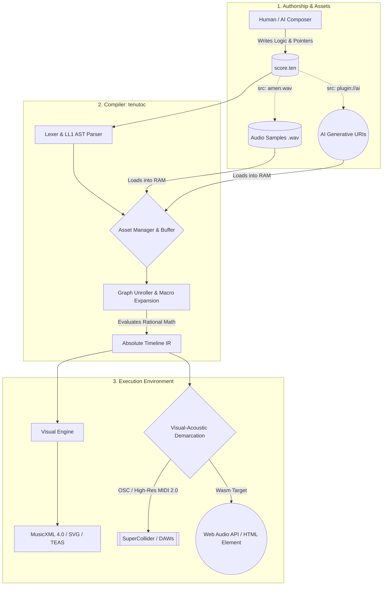
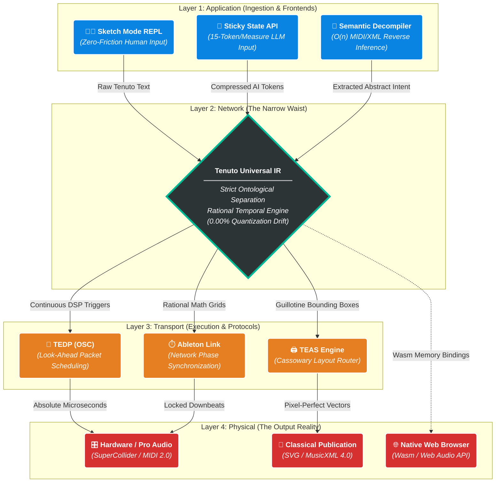

# Tenuto 3.0: The Universal Language for Music and Audio

**What LLVM did to software engineering and Mermaid did for diagrams, Tenuto does for music.**

Tenuto is a declarative, domain‑specific language (DSL) that unifies classical music notation and modern digital signal processing (DSP) into a single, token‑efficient text format. Built on a mathematically rigorous architecture, Tenuto acts as a universal logic layer: you write the musical intent once, and the compiler can natively render it as pixel-perfect sheet music, absolute MIDI data, real‑time synthesis instructions, or native browser audio. 

---

## ⚠️ The Problem Tenuto Solves
Today’s digital music landscape is fractured by a massive "Semantic Gap":
*   **DAWs are closed ecosystems.** Project files are proprietary binary blobs that suffer from bit rot and vendor lock‑in. A session saved today may be unreadable in ten years when a VST plugin deprecates.
*   **MusicXML is bloated.** Classical notation formats are visually bound and incredibly verbose—a single measure can consume over 1,500 tokens, making them hostile to version control and prohibitively expensive for Generative AI models to process.
*   **MIDI lacks structure.** MIDI captures performance data but discards semantic intent, loops, key signatures, and tuplets. It’s a recording of button presses, not a representation of music.
*   **AI music is static.** Generative models output flattened `.wav` files. If a single note is wrong, the entire file must be regenerated—there is no editable source.

Tenuto solves these problems by providing a **semantic, archival‑safe, and editable standard**. It enforces *Strict Ontological Separation*, decoupling *what* the music is (the logic/intent) from *how* it sounds (the physics/execution).

---

## 🌌 The Scope of the Tenuto Ecosystem
Tenuto is not just a syntax; it is an entire suite of interrelated architectures designed to govern the future of digital audio.

### 1. The Core Language (T-MRL) & The Six Cognitive Engines
Tenuto's compiler (`tenutoc`) doesn't just parse notes; it dynamically routes text through **Six Cognitive Physics Engines** based on the instrument's definition:
*   🎹 `style=standard`: The Helmholtz Model. Parses Scientific Pitch Notation, applying classical transposition and Elaine Gould's Accidental State Machine.
*   🧠 `style=relative`: The Smart Voice-Leading Model. Overrides absolute octaves with intervallic tritone-boundary calculations, allowing sweeping melodies to be written without ever typing an octave integer.
*   🎸 `style=tab`: The Physical Model. Parses spatial coordinates (`0-6`), calculating absolute pitch via $O(1)$ Inverse String array lookups. Natively supports continuous 14-bit string bends and slides.
*   🥁 `style=grid`: The Discrete Trigger Model. Maps alphanumeric tokens to absolute execution triggers.
*   🎛️ `style=synth`: The Continuous Frequency Model. Maps global ADSR envelopes, executes monophonic choke groups, and calculates continuous 14-bit portamento `.glide()` and `.accelerate()` pitch dives.
*   🌊 `style=concrete`: The Schaefferian Model. Maps raw audio buffer slices to alphanumeric text. Applies `.slice(N)` granular chopping and `.stretch` phase-vocoding directly from the text timeline.

### 2. Tenuto Studio Architecture (TSA) & Generative Ergonomics
Tenuto was explicitly engineered to be the ultimate target language for Large Language Models (LLMs) and Agentic workflows.
*   **Token-Efficient "Sticky State":** A stateful cursor persists attributes (duration, octave, velocity) until explicitly mutated. This compresses data by up to 90%, averaging just **15-25 tokens per measure**.
*   **Agentic REPL & JSON Diagnostics:** If an AI hallucinates mathematically invalid code, the runtime does not crash. It returns a structured JSON payload detailing the mathematical deficit, allowing the LLM to autonomously self-correct.
*   **Auto-Padding Polyphony:** The compiler features a fail-safe that intercepts broken multi-voice math, dynamically injecting invisible rests to balance the grid and preserve the compile process.

### 3. Tenuto Execution & Delegation Protocol (TEDP)
Tenuto does not reinvent audio synthesis—it orchestrates it. 
*   **Networked DSP:** Compiles abstract logic into Open Sound Control (OSC) bundles with look-ahead scheduling, triggering high-performance engines like SuperCollider or dynamically spawning execution threads in ChucK.
*   **Ableton Link Synchronization:** For live Algoraves, the `tenutod` daemon locks its internal rational grid to a shared network phase, injecting live-coded changes seamlessly on the perfect mathematical downbeat.
*   **Zero-Friction Wasm:** The parser compiles to WebAssembly (`wasm32-unknown-unknown`), allowing the `<tenuto-score>` HTML custom element to execute procedural music via the browser's native Web Audio API with zero plugins.

### 4. Tenuto Engraving Architecture (TEAS)
How do you print an 808 pitch dive or an invisible sidechain LFO? You don't. 
*   **Visual-Acoustic Demarcation:** The compiler executes a Demarcation Pass, aggressively pruning audio-only attributes and hiding unprintable physics from the page.
*   **The Rebarring Guillotine:** Abstract logic is mapped to an absolute timeline, then mathematically sliced across rigid measure boundaries to generate perfectly tied sheet music.
*   **Next-Gen Engraving:** Future versions utilize Data-Oriented Design (ECS), the Cassowary linear constraint solver for horizontal spring-mass justification, and SIMD-Accelerated Skylines for pixel-perfect vertical collision detection.

### 5. Semantic Decompilation (Addendum D)
The $O(n)$ deterministic reverse-inference engine. It ingests explicit, bloated machine formats (MIDI/MusicXML) and mathematically reverse-engineers them into idiomatic Tenuto. It uses LZ77 dictionary coding to extract redundancies into `$macros`, and runs the Bresenham line-drawing algorithm in reverse to snap raw MIDI hits back into highly compressed Euclidean tuplets.

### 6. Sketch Mode (Addendum F)
For the 5-second napkin doodle. A zero-friction REPL wrapper that hides all structural boilerplate, allowing composers to type `c4:8 d e f` into a browser console for instant playback, with an `eject` command to translate the doodle into a fully scaffolded, archival-safe `.ten` file.

---

## ⏱️ The Rational Temporal Engine (0% Drift)
Most sequencers and DAWs suffer from floating-point quantization drift over long timelines. 

Tenuto calculates time using pure **Rational Arithmetic (P/Q)**. 
*   **Euclidean Topologies (`(k):3/8`):** Distribute $K$ pulses over $N$ subdivisions mathematically. 
*   **Physical Micro-Timing:** The engine fully decouples Logical Grid Time (for sheet music) from Physical Playback Time. Modifiers like `.pull(15ms)` or `.push(10ticks)` shift the audio execution by absolute fractions of a second based on the global tempo, injecting deep "pocket" groove without corrupting the printed page.
*   **Deterministic Humanization:** Applying `meta @{ humanize: 0.05 }` executes a Box-Muller Gaussian randomization algorithm across the timeline. Seeded by absolute ticks, it generates the exact same mathematically "humanized" performance on every compilation.

---

## ⚙️ How It Works: The Pipeline

The `tenutoc` compiler transforms a Tenuto source file into absolute‑time instructions through a strict compilation pipeline:



---

## 💻 Writing Tenuto (Syntax Example)
A single `.ten` file can simultaneously orchestrate acoustic sheet music, continuous piano pedaling, granular sample slicing, and micro-timed electronic beats. 

```tenuto
tenuto "3.0" {
  meta @{ 
    title: "Olympia - The Producer Suite", 
    tempo: 108, time: "4/4", 
    auto_pad_voices: true, humanize: 0.04
  }

  %% INSTRUMENT PHYSICS: We define the cognitive engines routing the code.
  def rh "Right Hand" style=relative clef=treble patch="gm_piano"
  def lh "Left Hand"  style=standard clef=bass patch="gm_piano"
  def orch "Orchestra" style=grid map=@{ sn: 38, crash: 49 }
  def vox "Vocal Chop" style=concrete src="./vocals.wav" map=@{ a:[0.0s, 1.2s] }
  def sub "808 Bass" style=synth cut_group=1

  measure 1-4 {
    lh: <[ 
      v1: eb1:2.ff [bb1 eb2 g2]:2 | bb0:2[f1 bb d2]:2 | 
      %% DECOUPLED CONTROL LANE: Press the sustain pedal for a whole note, 4 times.
      pedal: down:1 * 4 | 
    ]>
    rh: 
      %% RELATIVE PITCH: Octaves are automatically calculated based on proximity![eb4 g bb eb5]:4.marc eb5:32 f g ab bb c d eb[g bb eb g]:2.marc |
      ([bb4 d5 f bb]:8 [c eb ab c] [d f bb d]):3/2 [ab c eb ab]:2.pull(15ms) |
    
    orch: 
      %% EUCLIDEAN TOPOLOGY: Dynamically distribute 5 snare hits across 8 subdivisions.
      (sn:2):5/8 sn:4.roll(3) | 
      sn:16 * 16 |
    
    vox:
      %% SCHAEFFERIAN ENGINE: Slice the audio buffer into 4 mathematically equal segments
      a:2.slice(4).stretch.reverse r:2 |

    sub:
      %% SYNTH PHYSICS: A 14-bit portamento glide and a 12-semitone pitch dive.
      eb2:2.glide(150ms) eb3:2.accelerate(-12) |
      
      %% ACTION NOTATION: The 's' spacer draws an invisible CC LFO curve!
      s:2.cc(7,[127, 0], "exp") |
  }
}
```

---

## 🚀 Current Status & Roadmap

The **Tenuto v3.0 Specification** is finalized, and the core Rust compiler architecture is fully operational. 

- 🟢 **Available Now (v3.0.1 - The Producer Update):**  
  The `main` branch contains the highly optimized Rust compiler (`tenutoc`). It is 100% core-compliant with the v3.0 Spec, featuring **Grid Snapping** to prevent AI temporal drift. It is capable of parsing Euclidean rhythms, generative auto-padding, concrete sampling, the Lyric Engine, and synth physics. It explicitly exports to `.mid` (MIDI) and `.musicxml` (MusicXML 4.0) via a strict Visual-Acoustic Demarcation pass.  
  ```bash
  cargo install --path .
  tenutoc --input score.ten --output score.mid
  ```

- 🔵 **In Development (The Extended Ecosystem):**
  - **Phase VI (`tenutod`):** Building the background daemon, Ableton Link phase synchronization, and OSC emitter backend for SuperCollider/ChucK.
  - **Phase VII (`wasm32`):** Compiling the parser to WebAssembly and building the `<tenuto-score>` HTML Web Component.
  - **Phase VIII (`tenuto-engrave`):** The native Rust TEAS engine utilizing the Cassowary constraint solver to render publication‑ready SVG sheet music directly from Tenuto source.
  - **Phase IX (`tenuto-decompile`):** The $O(n)$ reverse-inference pipeline to algorithmically compress raw MIDI/XML back into idiomatic, human-readable Tenuto code.

---

## 🤝 Contributing

Tenuto is an open standard and an open‑source project. We are actively seeking contributors in the following areas:

- **Rust Engineering:** WebAssembly compilation, constraint-solving (Cassowary), and network daemons (Ableton Link / OSC).
- **AI/ML Research:** Fine‑tuning LLMs on the Tenuto syntax and integrating generative audio plugin endpoints.
- **Audio DSP:** Refining the SuperDirt and ChucK mapping protocols.

- [Read the Full v3.0 Specification](https://github.com/alec-borman/TenutoNotationLanguage/blob/main/docs/SPEC.md)
- [Join the Discussions](https://github.com/alec-borman/TenutoNotationLanguage/discussions)
- [Report an Issue](https://github.com/alec-borman/TenutoNotationLanguage/issues)

**License:** MIT

---
*Tenuto: Write music as code. Compile to everything.*
