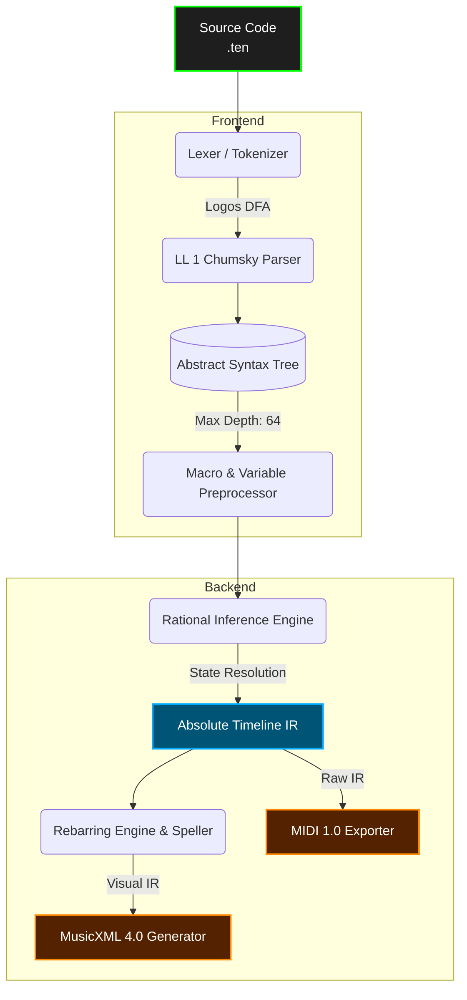

# Tenuto Reference Compiler (`tenutoc`)

> **The Semantic Markup Language for Musical Intent.**  
> What HTML did for document structure, and Mermaid.js did for diagrams, Tenuto does for music.


`tenutoc` is the official Rust-based reference compiler for **Tenuto**, a declarative domain-specific language (DSL) for musical composition.

Historically, digital music representation has been forced into a compromise. Formats like MusicXML are deeply visual—obsessed with where ink sits on a page—making them incredibly verbose, fragile to edit, and hostile to version control. Conversely, hardware protocols like MIDI are purely mechanical, capturing byte-level performance while stripping away all structural context (measures, spelling, tuplets).

**Tenuto bridges the semantic gap.** It serializes musical logic, instrument definitions, and performance data into a highly structured, human-readable text format. You write the *logic* of the composition, define the *physics* of the instruments, and let the compiler deterministically derive the mechanical output, audio, and **professional sheet music**.

---

## 🚀 Key Architectural Features

*   **Ontological Separation:** A strict programmatic division between Instrument Physics (tuning arrays, percussion maps, MIDI patches) and Musical Logic (pitches, rhythms, structural flow).
*   **Contextual Inference ("Sticky State"):** Tenuto acts like a human sight-reader. Attributes like duration (`:4`) and octave (`4`) persist until explicitly changed, natively eliminating data redundancy.
*   **Rational Temporal Engine:** Time is evaluated exclusively using exact fractions (ℚ). A triplet remains mathematically perfect ($\frac{1}{3}$), completely eliminating the floating-point quantization drift inherent in standard DAWs.
*   **Deterministic LL(1) Parsing:** Built on `chumsky` and `logos`, the engine utilizes compound sigils (`@{}` and `<[]>`) to guarantee linear-time parsing, infinite-loop protection, and robust error recovery.
*   **The Rebarring Engine (v2.1.1):** Automatically slices absolute-time events across visual barlines ("The Guillotine") and pads empty space with mathematically precise rests ("The Void Filler") to guarantee perfect layout syntax.
*   **Optimized for AI/ML:** By stripping away graphical layout bloat, Tenuto's highly token-efficient grammar provides an ideal, predictable syntax for LLM-driven algorithmic composition.

---

## 🤖 Optimized for AI & LLMs

Because Tenuto strips away graphical layout bloat and relies on a highly structured, token-efficient grammar, it natively solves the context-window limitations of Large Language Models.

> *"Tenuto represents what happens when deep musical knowledge meets rigorous software engineering. It's not just a file format—it's a complete theory of musical information representation. The clear grammar boundaries and Three-Engine model make it uniquely suited for algorithmic generation and deep musical analysis."*  
> — **DeepSeek AI (V3.2)** *after comprehensive specification analysis*

**Key AI-Compatible Advantages:**
* **Token Efficiency:** Where MusicXML consumes 1,000+ tokens for a single measure of polyphony, Tenuto consumes ~20.
* **Algorithmic Architecture:** Using native `$macro` and `$variable` systems, generative models can parameterize musical motifs exactly like functional code.
* **Semantic Richness:** Microtonality (`c4qs`) and physical performance techniques (`.bu(full)`) are baked directly into the lexical tokens, preventing ambiguity during generation.

---

## 🆚 The Syntax Advantage

Tenuto prioritizes developer ergonomics and extreme file-size reduction. Here is how four standard quarter notes are represented across formats:

**MusicXML (~150 tokens)**
```xml
<measure number="1">
  <note><pitch><step>C</step><octave>4</octave></pitch><duration>1</duration><type>quarter</type></note>
  <note><pitch><step>D</step><octave>4</octave></pitch><duration>1</duration><type>quarter</type></note>
  <!-- ... E and F omitted for brevity -->
</measure>
```

**Tenuto (7 tokens)**
```tenuto
measure 1 { vln: c4:4 d e f | }
```

---

## 💻 Quick Start

### 1. Installation

Build the compiler from source using Cargo:

```bash
git clone https://github.com/alec-borman/TenutoNotationLanguage.git
cd TenutoNotationLanguage
cargo build --release
```

### 2. Write a Tenuto File (`example.ten`)

The v2.1.1 syntax is clean, expressive, and strictly deterministic.

```tenuto
tenuto "2.1" {
  %% 1. Global Metadata (V2.1 Map Sigil)
  meta @{ title: "Tenuto Demo", tempo: 120 }

  %% 2. Instrument Definitions (The Physics)
  def pno "Piano"  style=standard patch="gm_piano"
  def gtr "Guitar" style=tab      tuning=guitar_std
  
  %% 3. Preprocessor Macros & Variables
  var my_vol = 80
  macro Motif(root) = { $root:8 d e f }

  %% 4. Musical Logic
  measure 1 {
    %% Polyphony using V2.1 Voice Brackets
    pno: <[
      v1: $Motif(c5).vol($my_vol) g5:2 | 
      v2: c3:1                         | 
    ]>

    %% Tablature with mechanical techniques
    gtr: 10-2:2.bu(full) 10-2.bd(0) |
  }
}
```

### 3. Compilation

Compile the source file into Audio (MIDI) or Sheet Music (MusicXML):

```bash
# Compile to Standard MIDI File
./target/release/tenutoc --input example.ten --output render.mid

# Compile to MusicXML 4.0 (for MuseScore, Dorico, etc.)
./target/release/tenutoc --input example.ten --output score.musicxml

# Strict mode (Halts on warnings, enforces explicit logic resets at barlines)
./target/release/tenutoc --input example.ten --strict
```

---

## 🏗️ Compiler Pipeline

The `tenutoc` architecture executes in distinct, modular phases, allowing developers to easily hook into the AST or intermediate representation.



1. **Lexer (`logos`):** Transforms the UTF-8 stream into tokens, natively isolating domain-specific primitives and V2.1 compound sigils.
2. **Parser (`chumsky`):** Generates the AST. Employs `ariadne` for advanced, context-aware error reporting and safe recovery.
3. **Preprocessor:** Expands `$macros`, recursively injects `$variables` into attributes/maps, and evaluates conditional build targets.
4. **Inference Engine (IR):** Resolves the relative "Sticky State" cursors and applies rational tuplet scalars to generate an absolute-time intermediate representation (`Timeline`).
5. **Rebarring & Spelling:** Slices absolute time into visual measures, derives tablature into standard notation via the Line of Fifths, and strictly applies Gould's accidental rendering rules.
6. **Exporters:** Serializes the unified data into targeted backend formats (`midly` for MIDI, custom zero-DOM string builder for MusicXML).

---

## 🗺️ Project Roadmap

The Tenuto Core Engine is feature-complete and backed by a comprehensive unit and integration test suite. Active development is now focused on the rendering ecosystem and developer tooling.

| Phase | Component | Status |
| :--- | :--- | :--- |
| **I** | Lexical Engine & Deterministic LL(1) Parser | ✅ Completed (v2.1.0) |
| **II** | Rational Inference Engine (Sticky State) | ✅ Completed (v2.1.0) |
| **III** | MIDI 1.0 / Synthesis Backend | ✅ Completed (v2.1.0) |
| **IV** | MusicXML 4.0 Export & Rebarring Algorithm | ✅ Completed (v2.1.1) |
| **V** | The Language Server Protocol (LSP) | ⏳ Planned |
| **VI** | Real-Time Collaboration Daemon (`tenutod`) | ⏳ Planned |
| **VII**| Direct SVG Engraving (SMuFL Integration) | ⏳ Future |

---

## 🤝 Contributing

We welcome contributions from compiler engineers, music theorists, and Rust developers. Priority areas include expanding the MusicXML layout capabilities and planning the SVG rendering pipeline.

1. Review the [Tenuto v2.1.1 Language Specification](./docs/SPEC.md).
2. Review the [Compiler API Reference](./docs/API.md).
3. Ensure all pipeline tests pass before submitting a PR:
   ```bash
   cargo test
   ```

## 📄 License

This project is licensed under the MIT License. See the `LICENSE` file for details.

**Maintainer:** Alec Borman & The Tenuto Working Group
