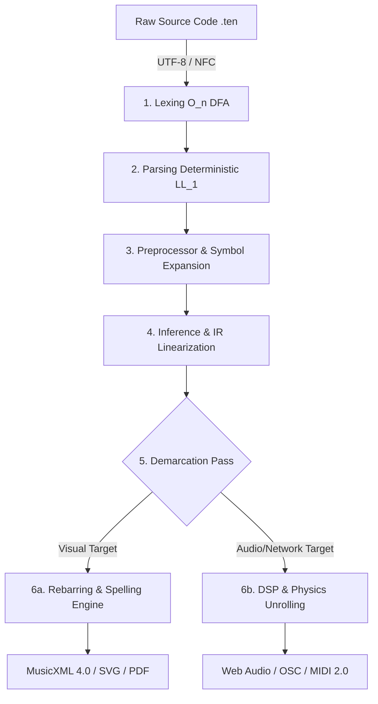
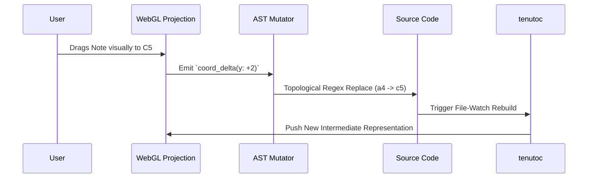

# 𝄆 TENUTO 4.0.0 𝄇
### The Declarative Protocol for Musical Physics & Logic
**Canonical Language Specification**

**Version:** 4.0.0 (The Declarative Protocol Edition)  
**Status:** Normative / Final  
**License:** MIT  
**Maintainers:** The Tenuto Working Group & The Teleportation Protocol Foundation  
**Reference Implementations:** Python 3.11+ (Native), JavaScript / Node.js 20+ (V8), WebAssembly (Browser/Edge)  

> **Executive Abstract**  
> Tenuto 4.0.0 is an enterprise-grade, deterministic, declarative domain‑specific language (DSL) that mathematically unifies the discrete, topological universe of acoustic sheet music with the continuous, high-dimensional physics of digital signal processing (DSP). By implementing a Stateful Cursor, Rational Time evaluation, and an infinitely extensible Abstract Syntax Tree (AST), Tenuto compiles flawless MusicXML, sub-millisecond precise MIDI 2.0, and continuous audio buffers from a single, token-efficient, human-readable text file. It stands as the definitive programmatic interface for human composers, and the ultimate "Day Zero" execution environment for Artificial Intelligence orchestration.

---

## PART I: THE CORE ARCHITECTURE

### 1.1 The Four Core Axioms

1. **Inference Over Redundancy (The Stateful Cursor):** Musical notation is inherently sequential. XML‑based formats exhibit catastrophic verbosity. Tenuto defeats this utilizing a strict **Sticky State** cursor. Parameters such as duration (`:4`), octave (`4`), and amplitude (`.ff`) persist in the compiler’s memory until explicitly mutated, achieving up to a **90% reduction in token count**—massively optimizing the format for LLM context windows.
2. **Strict Ontological Separation:** Tenuto rigorously isolates the *Physics* of an instrument (tuning matrices, ADSR envelopes, RAM sample allocations) from the *Logic* of the performance (rhythms, pitches, micro‑timing). 
3. **Absolute Mathematical Truth (Rational Time):** Evaluating irrational rhythms on an arbitrary DAW integer grid inherently causes IEEE 754 floating‑point drift. Tenuto’s Inference Engine evaluates all time utilizing **Rational Arithmetic** ($\mathbb{Q} = \frac{P}{Q}$), coercing fractions into scalar physical ticks only at the final microsecond of rendering.
4. **Electronic & Acoustic Parity:** Abstract DSP manipulations—time‑stretching, sidechain ducking, granular slicing, and portamento glides—are elevated to native semantic primitives, accessible via the same unified syntax used for classical articulations (`.stacc.vol(80).stretch`).

### 1.2 The Deterministic Compilation Pipeline ($T_c$)

A compliant Tenuto 4.0.0 compiler **MUST** execute a rigid, deterministic, six-stage architecture:



### 1.3 Conformance Profiles

To foster a robust, open ecosystem, compilers **MUST** declare a Conformance Profile. However, **ALL** compilers **MUST** implement the universal LL(1) Lexer/Parser for the entire grammar; features excluded by a profile **SHALL** be gracefully bypassed (AST Pruning) rather than throwing lexical errors.

* **Profile A (Core Logic):** Supports Stateful Cursor, Rational Time, and Polyphony. Emits MIDI/MusicXML.
* **Profile B (Native Audio):** Profile A + ADSR Envelopes, Buffer Slicing, and Continuous Interpolation. Emits `.wav` or Web Audio API.
* **Profile C (Network/Delegation):** Profiles A & B + Look-Ahead Scheduling and Synchronized Clock Protocols (OSC, sACN, Ableton Link).

---

## PART II: LANGUAGE MECHANICS & SYNTAX

Source files **MUST** be encoded in **UTF‑8** and normalized to Unicode NFC. Keywords (`def`, `measure`) and Note Names (`c4`) are case-insensitive. Identifiers and strings are case-sensitive. Comments are denoted by `%%`.

### 2.1 Operators & Compound Sigils
Tenuto relies on strict compound sigils to mathematically differentiate structural scopes from internal data arrays, eliminating parser ambiguity.

| Sigil | Formal Name | Compiler Application |
|:---:|---|---|
| `{ }` | **Structural Braces** | Defines compilation phases, global scopes, and macro definitions. |
| `<[ ]>` | **Voice Brackets** | Triggers the Polyphonic Parallel Engine and sandboxes state. |
| `@{ }` | **Map Sigil** | Triggers Key‑Value Dictionary parsing (Metadata, physics parameters). |
| `[ ]` | **Chord/Array Brackets** | Unrolls discrete pitches into simultaneous atomic events. |
| `:` | **Assignment / Ratio** | Binds logic to Staff IDs, explicit duration (`:4`), or Tuplet/Euclidean limits. |
| `.` | **Attribute Dot** | Accessor for chaining sequential DSP modifiers (`.stacc.stretch`). |
| `$` | **Invocation Dollar** | Signals the Preprocessor to evaluate the Symbol Table. |

### 2.2 Domain‑Specific Primitives
| Primitive Type | Regex Boundary Pattern | Semantic Evaluation |
|---|---|---|
| **PitchLit** | `(?i)[a-g](qs\|qf\|tqs\|tqf\|x\|#\|b\|n)*[0-9]?([+-][0-9]+)?` | The fundamental unit of acoustic frequency. |
| **TabCoord** | `(?i)[0-9xX]+-[1-9][0-9]*` | Formatted strictly as `Fret-String`. |
| **TimeVal** | `[0-9]+(\.[0-9]+)?(ms\|s\|ticks)` | Absolute continuous physical time units. |
| **Attribute** | `\.[a-zA-Z_]\w*` | Chained method names (`.roll`, `.ghost`). |

### 2.3 Document Topology & Additive Merging

A well‑formed Tenuto document represents a fully encapsulated unit enforcing **Declaration‑Before‑Use**.

```tenuto
tenuto "4.0" {
  %% Phase 1: Configuration
  meta @{ title: "The Billion Dollar Spec", tempo: 120, time: "4/4" }

  %% Phase 2: Definition (Physics)
  def pno "Grand Piano" style=standard patch="gm_piano"
  def vox "Lead Vocal"  style=concrete src="./vocals.wav" map=@{ a:[0s, 1.5s] }

  %% Phase 3: Logic (Additive Merging)
  measure 1 {
    pno: c4:4 d e f |
    vox: a:2.stretch r:2 |
  }
}
```

**The Additive Merge Rule:** If `measure 1` is populated in a piano scope, and subsequently invoked in a vocal scope, the Inference Engine **MUST** mathematically snap the start‑tick of the vocal logic to the exact absolute timestamp of the piano logic.

---

### 3. Instrument Definitions (The Cognitive Engines)

The `def` statement acts as a constructor, defining the internal Cognitive Engine via the `style` attribute.

| Style Enum | The Cognitive Routing Engine | Expected Input |
|---|---|---|
| **`standard`** | **The Helmholtz Model.** Parses Scientific Pitch Notation. | `c4`, `ebqs5` |
| **`tab`** | **The Physical Model.** Parses spatial instrument coordinates. | `0-6` (Fret-String) |
| **`grid`** | **The Discrete Trigger Model.** Parses arbitrary keys to MIDI. | `k`, `s`, `h` |
| **`concrete`** | **The Schaefferian Model.** Bypasses synthesis for raw audio. | Mapped string tokens |
| **`synth`** | **The Continuous Frequency Model.** Global ADSR/LFO targets. | `PitchLit` + curves |

---

### 4. The Temporal Engine: Rhythm & Micro-Timing

Tenuto strictly bifurcates time into two tracking vectors within the `AtomicEvent` IR: **Logical Grid Time** and **Physical Playback Time**.

* **Rational Math:** Duration is appended via a colon (`:4`, `:16.`). Multipliers use an asterisk (`* 4`). Internally, a quarter note is stored strictly as $1/4$.
* **`.push(TimeVal)` / `.pull(TimeVal)`:** Shifts the physical audio gate execution while leaving the Logical Grid mathematically perfect for clean sheet music export. `.pull(10ms)` shifts playback exactly 10 milliseconds late, regardless of track BPM.
* **Atemporal Events (Grace Notes):** `:grace` consumes $0$ logical metric capacity, stealing a physical fraction of the parent note’s `gate_ticks` for execution.

---

### 5. The Pitch Engine (`style=standard`)

Anchored to the absolute physical constant of $A_4 = 440.0\text{ Hz}$.

* **The Sticky Octave:** `c4 d e` parses identically to `c4 d4 e4`. 
* **Forward-Looking Ties (`~`):** `c4~ c:8` queues the initial event, mathematically extending its `gate_ticks` while suppressing the subsequent NoteOn trigger.
* **Gould’s Rules & The Accidental State Machine:** While the Tenuto AST relies on strictly stateless accidentals (`f#4` means exactly one F-sharp), Phase 6a (Visual Translation) routes pitches through a rigorous state machine enforcing Elaine Gould’s typesetting rules: independent per-octave memory, absolute barline resets, and explicit natural sign (`♮`) injection.

---

### 6. Euclidean Topologies & Advanced Polyphony

Version 4.0.0 supercharges the polyphonic engine by bifurcating the Tuplet syntax to natively support algorithmic electronic rhythms.

* **Voice Isolation (`<[ ]>`):** Voices are sandboxed. In `--strict` mode, every voice block **MUST** sum to the exact same total absolute duration (throws `E3002`).
* **Polyrhythm (Space-Separated):** `(c4:8 d e):3/2`. Compresses three 8th notes into the duration of two.
* **Algorithmic Euclidean (Single Token):** `(k):3/8`. Triggers the Bresenham line-drawing algorithm. It clones the single event 3 times and distributes it as evenly as possible across an 8-step grid, outputting the classic *tresillo* pattern in just 8 characters.

---

### 7. Dynamic Signal Interaction & Automation

Tenuto abandons convoluted DAW routing graphs in favor of Action Notation. By utilizing Polyphonic Voice Brackets and the **Spacer (`s`)** token, composers can draw pure, invisible automation curves (LFOs).

```tenuto
sub: <[
  v1: c2:1 |                                  %% The 808 note, held for a whole note
  v2: s:4.cc(7, [0, 127], "exp") * 4 |        %% Sidechain: Volume ramps 0->127 exponentially every quarter note
]>
```

---

### 8. Formal Grammar Specification (EBNF)

```ebnf
Score           ::= Header? TopLevel*
Header          ::= "tenuto" STRING? 
TopLevel        ::= Import | Definition | VariableDecl | MacroDef | Block | MetaBlock

Definition      ::= "def" IDENTIFIER STRING? DefAttr*
VariableDecl    ::= "var" IDENTIFIER "=" Value
MacroDef        ::= "macro" IDENTIFIER "(" ParamList? ")" "=" "{" Voice "}"

Block           ::= "measure" (INTEGER | Range | List)? MetaBlock? "{" Logic* "}"
Logic           ::= Assignment | MetaBlock | Conditional
Assignment      ::= IDENTIFIER ":" (VoiceGroup | MultiVoiceBlock)
MultiVoiceBlock ::= "<[" Voice ("|" Voice)* "]" ">"

Voice           ::= (Event | Tuplet | Euclidean | MacroCall)*
Event           ::= (PITCH_LIT | Chord | TAB_COORD | "r" | "s" | IDENTIFIER) DURATION? Modifiers*

Tuplet          ::= "(" Voice ")" ":" INTEGER "/" INTEGER
Euclidean       ::= "(" IDENTIFIER ")" ":" INTEGER "/" INTEGER
MacroCall       ::= "$" IDENTIFIER ("(" ArgList ")")? Transposition?

Modifiers       ::= ("." IDENTIFIER ("(" ArgList ")")? | "~")
Transposition   ::= ("+" | "-") INTEGER
```

---

## PART III: THE ENTERPRISE & SPATIAL ECOSYSTEM (ADDENDA A–M)

> The following Normative Addenda elevate Tenuto 4.0.0 from a localized text compiler into a Tier-1 infrastructure protocol capable of orchestrating cloud AI, live theatrical arrays, LLM semantic indexing, and bi-directional UI mutation.

### Addendum A: The Universal Semantic Conductor (Delegation)
To maintain token efficiency, `tenutoc` implements a **Delegation Architecture**. It packages linearized IR structures into NTP-timestamped OSC bundles, routing them predictively (Look-Ahead Scheduling) to external physics engines like **SuperCollider (SuperDirt)** or **ChucK**. Integration with **Ableton Link** overrides local PPQ clocks, locking AST boundaries to peer-to-peer network phases for live Algoraves.

### Addendum B: The Zero-Friction Web Runtime
The `tenutoc` parser compiles to `wasm32-unknown-unknown` via Pyodide. The Web Runtime defaults to the browser's native Web Audio API, translating synth envelopes into `AudioWorkletNode` graphs. It exposes the `<tenuto-score src="song.ten">` HTML Custom Element for zero-friction client-side DOM embedding.

### Addendum C: Generative Ergonomics & Smart Compilation
To support linear AI-generative workflows without halting errors:
1. **Polyphonic Auto-Padding:** `meta @{ auto_pad_voices: true }` dynamically calculates maximum duration within a `<[ ]>` block and injects terminal rests, suppressing `E3002` crashes.
2. **Decoupled Control Lanes (`pedal:`):** Isolates CC64 piano sustain logic from complex pitch arrays.
3. **Relative Pitch Heuristics:** `style=relative` overrides absolute Sticky Octaves, utilizing the "Closest Interval (Tritone) Rule" to smartly infer octaves and prevent runaway drift during AI arpeggio generation.

### Addendum D: Deterministic Semantic Decompilation
A reverse inference pipeline that reverse-engineers explicit machine formats (MIDI/MusicXML) back into idiomatic Tenuto logic. It employs 15 strict algorithmic passes, including LZ77 Dictionary Coding (to extract `$macros`), Bresenham reversal (to deduce Euclidean `(k):3/8` tuplets), and Tritone Smoothing.

### Addendum E: Visual-Acoustic Demarcation
When compiling to visual targets (PDF/SVG), the AST executes an $\mathcal{O}(n)$ Demarcation Pass to prune **Unprintable Physics** (e.g., `.slice`, `.pull`). Tracks marked `style=concrete` are implicitly masked unless overridden with `@print(true)`, which invokes a **Graphic Notation Fallback** (aleatoric bounding boxes and continuous Bezier pitch curves).

### Addendum F: The REPL Architecture (Sketch Mode)
When invoked with `--sketch`, a normative pre-compilation layer seamlessly wraps raw text inputs (`c4:4 d e`) into a hidden compliant AST boilerplate. It preserves the "Sticky State" cursor across independent execution cycles, allowing zero-friction live coding that can later be `ejected` into fully formed archival files.

### Addendum G: Signal Routing & Spatial Audio Matrix
Collapses the mixing console into the AST. The `bus://` URI schema captures live audio streams for real-time granular manipulation without fatal circular dependency loops. Spatial primitives (`.pan`, `.orbit`) and abstract DSP chains (`.fx(reverb, @{mix: 0.9})`) are serialized as mathematical trajectories in the IR, guaranteeing cinematic spatial mixes render perfectly decades later independently of proprietary VSTs.

### Addendum H: Theatrical Orchestration Layer
Transforms Tenuto into a live show-control protocol. Utilizing IEEE 802.1 TSN (Time-Sensitive Networking), the `tenutod` daemon acts as a gPTP Grandmaster. It predictively delegates lighting (`style=sacn`) and laser geometry (`style=fb4`) with microsecond phase-alignment, completely eliminating reactive latency and "inter-system smear."

### Addendum I: Codebase Indexing (The RAG Blueprint)
For maintaining the Tenuto compiler via AI agents, this mandates **AST-Aware Semantic Chunking** using Tree-sitter. Code is vectorized and tagged by domain criticality (`domain:compiler`). This guarantees that LLMs accessing the repo via Retrieval-Augmented Generation (RAG) pull hyper-relevant, architecturally isolated logic blocks rather than fragmented text slices.

### Addendum J: The Bi-Directional Projectional DAW
Tenuto formalizes **Projectional Editing**. The DAW graphical interface possesses **zero proprietary binary state**; it is strictly a Vite+React WebGL projection of the compiler's IR. 


Human graphical interactions (mouse drags, block resizing) are algorithmically translated into absolute topological text-mutations directly within the source code, triggering real-time sub-millisecond LSP re-compilations. **The Code remains the absolute, singular Source of Truth.**

### Addendum K: Neural Acoustic Synthesis (Latent Audio Integration)
To ensure Tenuto operates as the ultimate standard for AI-assisted music production, Addendum K introduces native hooks for Latent Diffusion and Neural Audio models.
* **`style=neural`:** Routes logical timeline data directly to a local or cloud-based neural audio API.
* **Semantic Injection:** `ai_choir: s:1.prompt("A haunting gregorian chant")` constructs a secure API payload. The generated `.wav` buffer is deterministically mapped back to the timeline, treating the output identical to a `style=concrete` block.

### Addendum L: Cryptographic Provenance & Zero-Trust Execution
Because Tenuto logic can execute external Python backends and hardware lasers, enterprise implementations **MUST** guarantee absolute security.
* **C2PA Credentials:** `meta @{ provenance: @{ author: "0x...", ai_agent: "Claude 3.5" } }` automatically embeds cryptographic watermarks into the exported `.wav` ID3 tags.
* **The Sandbox Mandate:** Untrusted URIs enforce Path Traversal Guards (`E5001`), disable hardware execution (`style=sacn`, `style=fb4`), and strictly confine OSC packets to localhost (`127.0.0.1`).

### Addendum M: The Skybridge Protocol (Teleportation Ecosystem)
Tenuto 4.0 is a fully open-source, sovereign digital signal processing language. However, its core compiler was mathematically governed and generated utilizing the proprietary `.tela` **Teleportation Protocol**—a 1024-dimension vector geometry engine that governs LLM code determinism. 

The two projects operate in a **Tandem Skyscraper Architecture** connected by the "Skybridge." When the core team architects a feature, it is proven in `.tela` and poured into Tenuto's Python codebase. For end-users and open-source contributors, the Skybridge is severed; Tenuto requires no proprietary tools. 

**The Decoupling Mandate:**
While Tenuto acts as the crucible for Tela’s genesis phase, the `.tela` protocol is fundamentally **domain-agnostic**. Once Tenuto reaches 4.0.0 LTS stability, the Skybridge Protocol will decouple, allowing the Teleportation Engine to govern arbitrary enterprise architectures—from distributed databases to operating systems—leaving Tenuto as its pristine, sovereign offspring, and the eternal gold standard of how human creativity and autonomous AI engineering achieve absolute parity.
